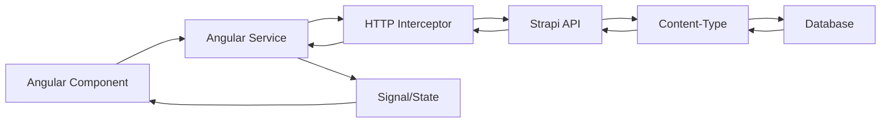

# 🎯 Concepts Clés des Frameworks - Guide d'Architecture

## Vue d'ensemble
Ce document liste les **concepts essentiels** de Strapi et Angular nécessaires pour couvrir **90% des cas d'usage** en développement fullstack moderne. L'objectif est la **maîtrise des fondamentaux** pour l'autonomie future.

---

## 🚀 **STRAPI v5 - Concepts Essentiels (Backend)**

### 🗄️ **1. Content-Types (Modèles de Données)**
**Concept** : Structure des données de l'application
```javascript
// Exemple Content-Type "Article"
{
  title: "string",
  content: "text", 
  author: "relation(User)",
  published: "boolean"
}
```
**90% Usage** : Définir tous vos modèles métier (User, Product, Order, etc.)

### 🔗 **2. Relations entre Content-Types**
**Types essentiels** :
- **One-to-One** : User → Profile
- **One-to-Many** : User → Articles (1 user, plusieurs articles)
- **Many-to-Many** : Articles ← → Tags (plusieurs à plusieurs)

**90% Usage** : Lier vos données logiquement (author, categories, likes...)

### 🌐 **3. API REST Automatique**
**Concept** : Strapi génère automatiquement les endpoints
```
GET    /api/articles        # Lister
POST   /api/articles        # Créer
GET    /api/articles/:id    # Détail
PUT    /api/articles/:id    # Modifier
DELETE /api/articles/:id    # Supprimer
```
**90% Usage** : CRUD complet sans code backend

### 🔒 **4. Authentification & Permissions**
**Concepts clés** :
- **JWT Tokens** pour l'authentification
- **Rôles** (Public, Authenticated, Admin)
- **Permissions par Content-Type** et action
- **Providers OAuth** (Google, GitHub...)

**90% Usage** : Sécuriser votre app et gérer les utilisateurs

### 📁 **5. Upload & Media Library**
**Concept** : Gestion des fichiers (images, audio, documents)
```javascript
// Champ media
image: "media" // Single file
gallery: "media" // Multiple files
```
**90% Usage** : Tous les uploads d'images, fichiers, avatars...

### 🔧 **6. Populate & Filtres**
**Populate** : Charger les relations
```javascript
GET /api/articles?populate=author,tags
```
**Filtres** : Recherche et tri
```javascript  
GET /api/articles?filters[title][$contains]=angular&sort=createdAt:desc
```
**90% Usage** : Récupérer exactement les données voulues

### ⚙️ **7. Middlewares & Lifecycle Hooks**
**Concept** : Intercepter les requêtes pour logique custom
```javascript
// Before create
beforeCreate(event) {
  event.params.data.slug = slugify(event.params.data.title);
}
```
**90% Usage** : Validation custom, transformation données, logs...

---

## ⭐ **ANGULAR v20 - Concepts Essentiels (Frontend)**

### 🧩 **1. Standalone Components (Moderne)**
**Concept** : Composants auto-suffisants sans NgModules
```typescript
@Component({
  selector: 'app-article',
  standalone: true,
  imports: [CommonModule, RouterModule],
  templateUrl: './article.component.html'
})
export class ArticleComponent { }
```
**90% Usage** : Architecture moderne, composants réutilisables

### 📡 **2. Services & Dependency Injection**
**Concept** : Logique métier centralisée et injectable
```typescript
@Injectable({ providedIn: 'root' })
export class ApiService {
  constructor(private http: HttpClient) {}
  
  getArticles() {
    return this.http.get<Article[]>('/api/articles');
  }
}
```
**90% Usage** : Communication API, état partagé, utilitaires

### 🔄 **3. Reactive Forms & Validation**
**Concept** : Formulaires typés et validés
```typescript
articleForm = this.fb.group({
  title: ['', Validators.required],
  content: ['', [Validators.required, Validators.minLength(10)]]
});
```
**90% Usage** : Tous vos formulaires (login, création, édition...)

### 🛣️ **4. Router & Navigation**
**Concept** : Navigation entre pages/vues
```typescript
const routes: Routes = [
  { path: '', component: HomeComponent },
  { path: 'articles/:id', component: ArticleDetailComponent },
  { path: 'create', component: CreateComponent, canActivate: [AuthGuard] }
];
```
**90% Usage** : Structure de navigation, protection des routes

### 📊 **5. Signals (State Management Moderne)**
**Concept** : Gestion d'état réactive et performante
```typescript
export class ArticleService {
  private articlesSignal = signal<Article[]>([]);
  articles = this.articlesSignal.asReadonly();
  
  addArticle(article: Article) {
    this.articlesSignal.update(articles => [...articles, article]);
  }
}
```
**90% Usage** : État global, cache, synchronisation données

### 🔧 **6. HTTP Interceptors**
**Concept** : Intercepter toutes les requêtes HTTP
```typescript
@Injectable()
export class AuthInterceptor implements HttpInterceptor {
  intercept(req: HttpRequest<any>, next: HttpHandler) {
    const authReq = req.clone({
      headers: req.headers.set('Authorization', `Bearer ${token}`)
    });
    return next.handle(authReq);
  }
}
```
**90% Usage** : Auth tokens, gestion erreurs, loading states

### 🎨 **7. Directives & Pipes**
**Directives structurelles** :
```html
<div *ngIf="user$ | async as user">{{ user.name }}</div>
<div *ngFor="let article of articles; trackBy: trackById">
```
**Pipes** :
```html
{{ article.createdAt | date:'short' }}
{{ article.title | titlecase }}
```
**90% Usage** : Affichage conditionnel, listes, formatage données

### 🎯 **8. Guards & Resolvers**
**Guards** : Protection des routes
```typescript
@Injectable()
export class AuthGuard implements CanActivate {
  canActivate(): boolean {
    return this.authService.isAuthenticated();
  }
}
```
**90% Usage** : Sécurité, chargement de données avant navigation

---

## 🏗️ **ARCHITECTURE PROJET - Corrélations**

### 📋 **Mapping Backend ↔ Frontend**

| **Concept Strapi** | **↔** | **Concept Angular** | **Usage Commun** |
|-------------------|-------|-------------------|------------------|
| Content-Type | ↔ | Interface/Model | Définition des données |
| API Endpoints | ↔ | HTTP Services | Communication données |
| Relations | ↔ | Observables/Signals | Données liées |
| Authentication | ↔ | Guards + JWT | Sécurité utilisateur |
| Upload API | ↔ | FormData + HTTP | Gestion fichiers |
| Permissions | ↔ | Route Guards | Contrôle d'accès |
| Populate | ↔ | HTTP Params | Optimisation requêtes |

### 🔄 **Flux de Données Typique**



### 🎯 **Pattern Architecture 90%**

**Structure Frontend (Angular)** :
```
src/
├── app/
│   ├── core/          # Services globaux, guards, interceptors
│   ├── shared/        # Composants/pipes réutilisables  
│   ├── features/      # Modules métier (articles, users...)
│   │   ├── models/    # Interfaces TypeScript
│   │   ├── services/  # Services API spécifiques
│   │   └── components/ # Composants du module
│   └── layouts/       # Layouts généraux
```

**Structure Backend (Strapi)** :
```
strapi-app/
├── src/api/           # Content-Types générés
├── config/           # Configuration (DB, auth, etc.)
├── middlewares/      # Logique transversale
└── extensions/       # Customisations Strapi
```

---

## 📊 **Les 90% de Cas Couverts**

### ✅ **Avec ces concepts, les étudiants peuvent construire** :

**🎯 Applications CRUD complètes** :
- Blog, e-commerce, portfolio, CMS
- Authentification utilisateur  
- Upload et gestion de médias
- Recherche et filtrage
- Relations entre données

**🔒 Applications sécurisées** :
- Gestion des rôles et permissions
- Protection des routes
- Validation des données
- Gestion des tokens JWT

**📱 Applications modernes** :
- Interface responsive
- État réactif avec Signals
- Navigation fluide
- Formulaires typés et validés

### 🚀 **Le 10% restant** (à apprendre au besoin) :
- Plugins Strapi avancés
- Optimisations performance poussées  
- Architecture micro-services
- Tests automatisés avancés
- Déploiement complexe

---

## 💡 **Stratégie d'Apprentissage**

### **Phase 1: Fondations** (Concepts 1-3)
- Content-Types + API REST (Strapi)
- Components + Services (Angular)
- **Objectif** : CRUD basique fonctionnel

### **Phase 2: Interactions** (Concepts 4-6)  
- Auth + Permissions (Strapi)
- Forms + Router (Angular)
- **Objectif** : Application utilisateur complète

### **Phase 3: Optimisation** (Concepts 7-8)
- Hooks + Upload (Strapi)  
- State + Guards (Angular)
- **Objectif** : Application production-ready

---

*Avec cette base solide, les étudiants auront l'autonomie pour explorer et apprendre le reste selon leurs besoins spécifiques !*