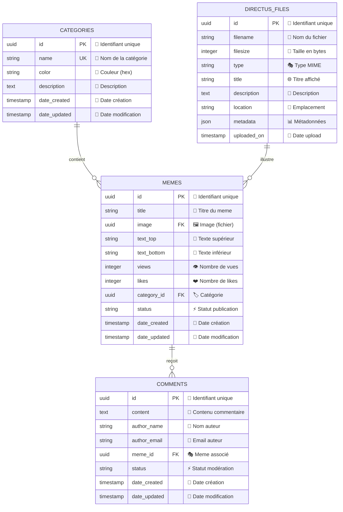

# 🎭 Tutoriel Backend Directus - Projet Meme Manager

## 📋 Table des Matières
1. [Introduction à Directus](#introduction-à-directus)
2. [Architecture du projet](#architecture-du-projet)
3. [Configuration initiale](#configuration-initiale)
4. [Création des collections](#création-des-collections)
5. [Gestion des médias](#gestion-des-médias)
6. [Relations entre collections](#relations-entre-collections)
7. [Configuration des rôles et permissions](#configuration-des-rôles-et-permissions)
8. [API et intégration](#api-et-intégration)
9. [Tests et validation](#tests-et-validation)

---

## 1. Introduction à Directus

### Qu'est-ce que Directus ?

Directus est un **headless CMS** (Content Management System) moderne qui transforme n'importe quelle base de données SQL en une API REST/GraphQL complète avec une interface d'administration intuitive.

**Concepts clés :**
- **Database-first** : Directus s'adapte à votre schéma de base de données existant
- **Headless** : Sépare le backend (gestion des données) du frontend (interface utilisateur)
- **API-first** : Génère automatiquement des APIs REST et GraphQL
- **No vendor lock-in** : Vos données restent dans une base SQL standard

### Avantages pour notre projet Meme Manager

- ✅ **Gestion automatique des médias** (upload, transformations, optimisation)
- ✅ **Interface d'administration** clé en main
- ✅ **API REST/GraphQL** générée automatiquement
- ✅ **Système de permissions** granulaire
- ✅ **TypeScript SDK** pour l'intégration Angular

*[Insérer screenshot : Interface d'administration Directus]*

---

## 2. Architecture du projet

### Structure de données du Meme Manager

Notre application va gérer :

```
👤 Utilisateurs (Users)
├── 🎭 Memes créés
├── ❤️ Memes likés
└── 💬 Commentaires postés

🎭 Memes
├── 🖼️ Image de base
├── 📝 Texte supérieur
├── 📝 Texte inférieur
├── 🏷️ Catégorie
├── 👤 Créateur
├── 📊 Statistiques (vues, likes)
└── 💬 Commentaires

🏷️ Catégories
├── 📛 Nom
├── 🎨 Couleur
└── 📖 Description

💬 Commentaires
├── 📝 Contenu
├── 👤 Auteur
├── 🎭 Meme associé
└── 📅 Date
```

### Modèle Conceptuel de Données (MCD)



### Relations et Cardinalités

**1️⃣ CATEGORIES → MEMES (1:N)**
- Une catégorie peut contenir plusieurs memes
- Un meme appartient à une seule catégorie
- Clé étrangère : `category_id` dans `memes`

**2️⃣ MEMES → COMMENTS (1:N)**  
- Un meme peut avoir plusieurs commentaires
- Un commentaire appartient à un seul meme
- Clé étrangère : `meme_id` dans `comments`

**3️⃣ MEMES → DIRECTUS_FILES (N:1)**
- Plusieurs memes peuvent utiliser le même fichier (réutilisation)
- Un meme a une image principale
- Clé étrangère : `image` dans `memes` vers `directus_files.id`

### Types de données Directus

```yaml
Categories:
  id: UUID (Primary Key, Auto-generated)
  name: String (Required, Unique, max 100 chars)
  color: String (Color picker, default #3B82F6)
  description: Text (Optional, max 500 chars)
  
Memes:
  id: UUID (Primary Key, Auto-generated) 
  title: String (Required, max 255 chars)
  image: File (Required, Images only)
  text_top: String (Optional, max 100 chars)
  text_bottom: String (Optional, max 100 chars)
  views: Integer (Default 0, Read-only)
  likes: Integer (Default 0)
  category_id: M2O Relation → Categories
  status: String (published/draft/archived)
  
Comments:
  id: UUID (Primary Key, Auto-generated)
  content: Text (Required, max 1000 chars)
  author_name: String (Required, max 100 chars)
  author_email: Email (Required, validation)
  meme_id: M2O Relation → Memes
  status: String (published/pending/rejected)
```

### Contraintes et Validations

**🛡️ Règles métier :**
- Les memes supprimés (archived) gardent leurs commentaires
- Les catégories ne peuvent être supprimées si elles contiennent des memes
- Les images doivent être au format web (JPEG, PNG, WebP, GIF)
- Taille maximale des images : 10MB
- Les commentaires en attente nécessitent une modération

*[Insérer screenshot : Visualisation du MCD dans un outil comme draw.io ou dbdiagram.io]*

---

## 3. Configuration et initialisation du projet

### Prérequis techniques

- Node.js >= 18.13.0
- npm >= 9.0.0
- Git

### Étape 1 : Initialisation rapide avec le CLI Directus

**La méthode moderne et simple :**

```bash
# Créer un nouveau projet Directus avec le template CLI
npx directus-template-cli@latest init mon-projet-meme-manager

# Naviguer dans le dossier créé
cd mon-projet-meme-manager
```

Cette commande va automatiquement :
- ✅ Créer la structure de fichiers
- ✅ Installer toutes les dépendances
- ✅ Configurer le fichier `.env` avec des valeurs par défaut
- ✅ Préparer les scripts npm

*[Insérer screenshot : Terminal avec la commande npx en cours d'exécution]*

**Options de configuration proposées :**
- **Project Name** : `mon-projet-meme-manager`
- **Database Type** : SQLite (recommandé pour le développement)
- **Admin Email** : Votre email
- **Admin Password** : Mot de passe sécurisé

*[Insérer screenshot : Interface interactive du CLI avec les questions]*

### Étape 2 : Premier démarrage

```bash
# Démarrer Directus en mode développement
npm run dev
```

Le CLI a automatiquement configuré tous les scripts nécessaires :
- `npm run dev` - Développement avec auto-reload
- `npm run start` - Production
- `npm run build` - Build du projet

*[Insérer screenshot : Console de démarrage Directus avec les logs]*

### Étape 3 : Première connexion

1. **Ouvrir le navigateur** sur http://localhost:8055
2. **Se connecter** avec les identifiants admin créés
3. **Explorer l'interface** d'administration

*[Insérer screenshot : Page de connexion Directus]*
*[Insérer screenshot : Dashboard admin après connexion]*

### Configuration spécifique au projet du cours

Pour notre projet de cours existant, les étapes sont simplifiées :

```bash
# 1. Installation des dépendances du monorepo
npm run install:all

# 2. Initialisation de Directus (déjà configuré)
npm run directus:init

# 3. Démarrage en mode développement
npm run directus:dev
```

### Structure des fichiers Directus

```
poc/directus-backend/
├── extensions/          # Extensions personnalisées
│   ├── hooks/          # Hooks personnalisés
│   ├── endpoints/      # Endpoints API custom
│   └── interfaces/     # Interfaces UI custom
├── uploads/            # Fichiers uploadés
├── data.db            # Base de données SQLite
├── .env               # Configuration environnement
├── package.json       # Dépendances Node.js
└── snapshot.yaml      # Schéma de base exporté (optionnel)
```

### Avantages du CLI Template

**Pourquoi utiliser `directus-template-cli` ?**

- 🚀 **Setup en une commande** - Fini les configurations manuelles !
- 🔧 **Configuration optimale** - Bonnes pratiques pré-configurées
- 📦 **Dépendances à jour** - Toujours la dernière version stable
- 🛡️ **Sécurité** - Clés et secrets générés automatiquement
- 📚 **Templates** - Différents templates selon le projet

**Comparaison avec l'installation manuelle :**

| Méthode | Temps | Complexité | Erreurs possibles |
|---------|--------|------------|-------------------|
| Manuel | ~10 min | 🔴 Élevée | Nombreuses |
| CLI Template | ~2 min | 🟢 Faible | Quasi-nulles |

### Vérification de l'installation

**Checklist de validation :**

- ✅ Directus démarre sans erreur
- ✅ Interface accessible sur http://localhost:8055
- ✅ Connexion admin fonctionnelle
- ✅ Base de données SQLite créée automatiquement
- ✅ Structure de fichiers complète

**Structure générée automatiquement :**

```
mon-projet-meme-manager/
├── extensions/          # Extensions personnalisées
├── uploads/            # Fichiers uploadés
├── .env               # Configuration auto-générée
├── package.json       # Scripts et dépendances
├── .gitignore         # Fichiers à ignorer
└── README.md          # Documentation du projet
```

**En cas de problème (rare avec le CLI) :**

```bash
# Supprimer et recréer le projet
rm -rf mon-projet-meme-manager
npx directus-template-cli@latest init mon-projet-meme-manager
```

*[Insérer screenshot : Interface d'administration vide prête à être configurée]*

---

## 4. Création des collections

### Comprendre les Collections Directus

Une **collection** dans Directus = une **table** en base de données
Chaque collection contient des **champs** (colonnes) avec des **types** spécifiques.

### 🏷️ Étape 1 : Créer la collection "Categories"

1. **Accéder aux collections**
   - Dans le menu principal → **Settings** → **Data Model**
   - Cliquer sur **"Create Collection"**

*[Insérer screenshot : Menu Data Model]*

2. **Configuration de base**
   - **Collection Name** : `categories`
   - **Collection Key** : `categories` (auto-généré)
   - **Archive** : Désactivé
   - **Accountability** : Activé
   - Cliquer sur **"Save"**

*[Insérer screenshot : Formulaire création collection]*

3. **Ajout des champs**

   **Champ "name" (Nom de la catégorie) :**
   - Type : **String**
   - Key : `name`
   - Display Name : "Nom"
   - Required : ✅ Oui
   - Unique : ✅ Oui

   **Champ "color" (Couleur de la catégorie) :**
   - Type : **String**
   - Key : `color`
   - Display Name : "Couleur"
   - Interface : **Color**
   - Default Value : `#3B82F6`

   **Champ "description" (Description) :**
   - Type : **Text**
   - Key : `description`
   - Display Name : "Description"
   - Interface : **Textarea**

*[Insérer screenshot : Configuration des champs de Categories]*

### 🎭 Étape 2 : Créer la collection "Memes"

1. **Créer la collection**
   - Collection Name : `memes`
   - Archive : Activé (pour permettre de "supprimer" sans perdre les données)
   - Accountability : Activé

2. **Ajout des champs essentiels**

   **Champ "title" (Titre du meme) :**
   - Type : **String**
   - Key : `title`
   - Required : ✅ Oui
   - Interface : **Input**

   **Champ "image" (Image de base) :**
   - Type : **File**
   - Key : `image`
   - Required : ✅ Oui
   - Interface : **File Image**
   - Allowed file types : `image/jpeg,image/png,image/gif,image/webp`

   **Champ "text_top" (Texte du haut) :**
   - Type : **String**
   - Key : `text_top`
   - Interface : **Input**

   **Champ "text_bottom" (Texte du bas) :**
   - Type : **String**
   - Key : `text_bottom`
   - Interface : **Input**

   **Champ "views" (Nombre de vues) :**
   - Type : **Integer**
   - Key : `views`
   - Default Value : `0`
   - Interface : **Input**

   **Champ "likes" (Nombre de likes) :**
   - Type : **Integer**
   - Key : `likes`
   - Default Value : `0`
   - Interface : **Input**

*[Insérer screenshot : Configuration des champs de Memes]*

### 💬 Étape 3 : Créer la collection "Comments"

**À vous de jouer ! 🎮**

En suivant la même méthode que pour les collections précédentes, créez la collection `comments` avec ces champs :

- `content` (Text, required) - Le contenu du commentaire
- `author_name` (String, required) - Nom de l'auteur
- `author_email` (String, required, format email) - Email de l'auteur
- `status` (String, default: 'published') - Statut de modération

*Conseil : Utilisez l'interface **Textarea** pour le champ content*

---

## 5. Gestion des médias

### Configuration du stockage de fichiers

Directus gère automatiquement l'upload et la transformation des médias. Voici comment optimiser cette fonctionnalité pour notre projet.

### Transformations automatiques d'images

1. **Accéder aux réglages de fichiers**
   - Settings → **Files & Thumbnails**

2. **Configuration des transformations**
   - **Thumbnail Generation** : ✅ Activé
   - **Quality** : 85 (bon compromis qualité/taille)
   - **Format** : WebP (pour l'optimisation)

*[Insérer screenshot : Configuration des transformations]*

### Utilisation des transformations dans l'API

Directus permet de transformer les images à la volée via l'URL :

```
# Image originale
GET /assets/[file-id]

# Redimensionnement
GET /assets/[file-id]?width=400&height=400

# Format et qualité
GET /assets/[file-id]?format=webp&quality=80

# Transformations combinées
GET /assets/[file-id]?width=800&height=600&fit=cover&quality=85&format=webp
```

### Types de fichiers autorisés

Pour sécuriser les uploads, configurons les types acceptés :

1. **Settings** → **Files & Thumbnails** → **File Type Allow List**
2. Ajouter : `image/jpeg`, `image/png`, `image/gif`, `image/webp`

*[Insérer screenshot : Configuration des types de fichiers]*

---

## 6. Relations entre collections

### Comprendre les relations Directus

Les relations permettent de lier les collections entre elles :

- **Many-to-One (M2O)** : Un meme appartient à une catégorie
- **One-to-Many (O2M)** : Une catégorie contient plusieurs memes
- **Many-to-Many (M2M)** : Les utilisateurs peuvent liker plusieurs memes

### 🔗 Étape 1 : Relation Memes → Categories (M2O)

1. **Aller dans la collection Memes**
   - Data Model → `memes`
   - Cliquer sur **"Create Field"**

2. **Configurer le champ de relation**
   - Type : **Many to One**
   - Key : `category`
   - Display Name : "Catégorie"
   - Related Collection : **categories**
   - On Delete : **SET NULL** (si la catégorie est supprimée, le meme reste)

*[Insérer screenshot : Configuration relation M2O]*

### 🔗 Étape 2 : Relation Comments → Memes (M2O)

**À vous de jouer ! 🎮**

Créez une relation dans la collection `comments` :
- Type : **Many to One**
- Key : `meme`
- Related Collection : **memes**
- On Delete : **CASCADE** (si le meme est supprimé, les commentaires aussi)

### 🔗 Étape 3 : Relations inverses automatiques

Directus crée automatiquement les relations inverses :
- Dans `categories` : champ virtuel `memes` (One to Many)
- Dans `memes` : champ virtuel `comments` (One to Many)

*[Insérer screenshot : Visualisation des relations dans l'interface]*

---

## 7. Configuration des rôles et permissions

### Système de permissions Directus

Directus utilise un système **RBAC** (Role-Based Access Control) :
- **Rôles** : Groupes d'utilisateurs avec des permissions spécifiques
- **Permissions** : Actions autorisées sur chaque collection
- **Politiques** : Règles conditionnelles avancées

### Création du rôle "Public"

1. **Accéder à la gestion des rôles**
   - Settings → **Access Control** → **Roles**
   - Cliquer sur **"Create Role"**

2. **Configuration du rôle**
   - **Name** : `Public`
   - **Description** : "Accès public en lecture seule"
   - **App Access** : ❌ Désactivé
   - **Admin Access** : ❌ Désactivé

*[Insérer screenshot : Création du rôle Public]*

### Configuration des permissions publiques

Pour chaque collection, définir les permissions :

**Collection Memes (Public) :**
- **Read** : ✅ Tous les items
- **Create** : ❌ Aucun
- **Update** : ❌ Aucun  
- **Delete** : ❌ Aucun

**Collection Categories (Public) :**
- **Read** : ✅ Tous les items
- **Create/Update/Delete** : ❌ Aucun

**Collection Comments (Public) :**
- **Read** : ✅ Tous les items publiés
- **Create** : ✅ Avec validation
- **Update/Delete** : ❌ Aucun

*[Insérer screenshot : Configuration des permissions]*

### Filtres conditionnels

Pour les commentaires, ajoutons un filtre pour ne montrer que les commentaires approuvés :

1. **Dans Comments → Read permissions**
2. **Custom Access** → **Use Custom Permissions**
3. **Filter** : `status = 'published'`

*[Insérer screenshot : Configuration des filtres]*

---

## 8. API et intégration

### Types d'API disponibles

Directus génère automatiquement :
- **REST API** : `/items/collection-name`
- **GraphQL API** : `/graphql`
- **SDK TypeScript** : Client typé pour Angular

### Endpoints REST principaux

```http
# Récupérer tous les memes avec leurs catégories
GET /items/memes?fields=*,category.name,category.color

# Récupérer un meme avec ses commentaires
GET /items/memes/[id]?fields=*,comments.content,comments.author_name

# Créer un nouveau commentaire
POST /items/comments
Content-Type: application/json
{
  "content": "Super meme !",
  "author_name": "John Doe",
  "author_email": "john@example.com",
  "meme": 1
}

# Upload d'une image
POST /files
Content-Type: multipart/form-data
# File in form data

# Transformer une image
GET /assets/[file-id]?width=800&height=600&quality=85&format=webp
```

### Intégration avec Angular

**Installation du SDK :**
```bash
cd poc/angular-frontend
npm install @directus/sdk
```

**Configuration du service :**
```typescript
// services/directus.service.ts
import { Injectable } from '@angular/core';
import { createDirectus, rest, readItems, createItem } from '@directus/sdk';

type Meme = {
  id: number;
  title: string;
  image: string;
  text_top?: string;
  text_bottom?: string;
  category?: Category;
  views: number;
  likes: number;
  date_created: string;
};

type Category = {
  id: number;
  name: string;
  color: string;
  description?: string;
};

@Injectable({
  providedIn: 'root'
})
export class DirectusService {
  private directus = createDirectus('http://localhost:8055').with(rest());

  async getMemes() {
    return await this.directus.request(
      readItems('memes', {
        fields: ['*', 'category.name', 'category.color']
      })
    );
  }

  async createComment(data: any) {
    return await this.directus.request(createItem('comments', data));
  }
}
```

*[Insérer screenshot : Code Angular avec autocomplétion TypeScript]*

---

## 9. Tests et validation

### Test de l'API via Directus

1. **Accéder à l'API Explorer**
   - Dans l'admin Directus → **API Documentation**
   - Tester les endpoints en direct

*[Insérer screenshot : API Explorer Directus]*

### Ajout de données de test

**Créer des catégories d'exemple :**
1. Aller dans **Content** → **Categories**
2. Cliquer sur **"Create Item"**
3. Ajouter :
   - Nom : "Memes Classiques", Couleur : `#3B82F6`
   - Nom : "Reaction Memes", Couleur : `#EF4444`
   - Nom : "Memes Programmeur", Couleur : `#10B981`

**Créer des memes d'exemple :**
1. **Content** → **Memes** → **"Create Item"**
2. Upload d'images et ajout de textes
3. Association avec une catégorie

*[Insérer screenshot : Interface de création de contenu]*

### Validation des relations

Vérifier que :
- ✅ Les memes affichent bien leur catégorie
- ✅ Les catégories listent leurs memes
- ✅ Les commentaires sont liés aux bons memes
- ✅ Les transformations d'images fonctionnent

### Tests des permissions

**Test en navigation privée :**
1. Ouvrir http://localhost:8055 en navigation privée
2. Tenter d'accéder aux collections sans authentification
3. Vérifier que seules les données publiques sont accessibles

---

## 🎉 Conclusion

Félicitations ! Vous avez maintenant un backend Directus complet pour votre application Meme Manager avec :

- ✅ **Collections structurées** avec relations
- ✅ **Gestion automatique des médias** avec transformations
- ✅ **API REST/GraphQL** prête à l'emploi
- ✅ **Système de permissions** sécurisé
- ✅ **Interface d'administration** intuitive
- ✅ **Intégration TypeScript** pour Angular

### Prochaines étapes

1. **Intégration frontend** : Connexion avec Angular
2. **Fonctionnalités avancées** : Système de likes, recherche, filtres
3. **Optimisations** : Cache, CDN pour les médias
4. **Déploiement** : Configuration production

---

## 📚 Ressources utiles

- **Documentation Directus** : https://docs.directus.io
- **API Reference** : https://docs.directus.io/reference/introduction
- **TypeScript SDK** : https://docs.directus.io/guides/sdk/getting-started
- **Community** : https://discord.gg/directus

---

*Tutoriel créé pour le cours Directus + Angular - Bonne chance pour la suite ! 🚀*