# 🎭 Tutoriel Backend Directus - Projet Meme Manager

## 📋 Table des Matières
1. [Introduction à Directus](#introduction-à-directus)
2. [Architecture du projet](#architecture-du-projet)
3. [Configuration initiale](#configuration-initiale)
4. [Création des collections](#création-des-collections)
5. [Gestion des médias](#gestion-des-médias)
6. [Relations entre collections](#relations-entre-collections)
7. [Configuration des rôles et permissions](#configuration-des-rôles-et-permissions)
8. [API et intégration](#api-et-intégration)
9. [Tests et validation](#tests-et-validation)

---

## 1. Introduction à Directus

### Qu'est-ce que Directus ?

Directus est un **headless CMS** (Content Management System) moderne qui transforme n'importe quelle base de données SQL en une API REST/GraphQL complète avec une interface d'administration intuitive.

**Concepts clés :**
- **Database-first** : Directus s'adapte à votre schéma de base de données existant
- **Headless** : Sépare le backend (gestion des données) du frontend (interface utilisateur)
- **API-first** : Génère automatiquement des APIs REST et GraphQL
- **No vendor lock-in** : Vos données restent dans une base SQL standard

### Avantages pour notre projet Meme Manager

- ✅ **Gestion automatique des médias** (upload, transformations, optimisation)
- ✅ **Interface d'administration** clé en main
- ✅ **API REST/GraphQL** générée automatiquement
- ✅ **Système de permissions** granulaire
- ✅ **TypeScript SDK** pour l'intégration Angular

*[Insérer screenshot directus8.aviff: Interface d'administration Directus]*

---

## 2. Architecture du projet

### Structure de données du Meme Manager

Notre application va gérer :

```
👤 Utilisateurs (Users) - SYSTÈME DIRECTUS INTÉGRÉ
├── 🎭 Memes créés
├── ❤️ Memes likés  
├── 👤 Profil (nom, email, avatar)
└── 🔐 Authentification

🎭 Memes
├── 🖼️ Image de base
├── 🏷️ Tags (multiples)
├── 👤 Créateur (utilisateur connecté)
├── 📊 Statistiques (vues, likes)
└── ❤️ Liste des utilisateurs qui ont liké

🏷️ Tags
└── 📛 Nom

🔔 Notifications (Système temps réel)
├── 👤 Utilisateur destinataire
├── 📝 Message de notification
├── 🎭 Meme associé (optionnel)
├── 🔄 Type d'événement (nouveau_meme, nouveau_like, nouveau_tag)
├── ✅ Statut (lu/non_lu)
└── 📅 Date de création
```

### Modèle Conceptuel de Données (MCD)

```mermaid
erDiagram
    DIRECTUS_USERS {
        uuid id PK "🔑 Identifiant unique"
        string first_name "👤 Prénom"
        string last_name "👤 Nom"
        string email UK "📧 Email (unique)"
        string password "🔐 Mot de passe (hashé - optionnel pour OAuth)"
        uuid avatar FK "🖼️ Photo de profil"
        string status "⚡ Statut compte"
        string provider "🔗 Méthode connexion (default/github/google)"
        string external_identifier "🆔 ID externe (GitHub ID, Google ID, etc.)"
        timestamp date_created "📅 Date création"
        timestamp last_access "📅 Dernière connexion"
    }
    
    TAGS {
        uuid id PK "🔑 Identifiant unique"
        string name UK "📛 Nom du tag"
        timestamp date_created "📅 Date création"
        timestamp date_updated "📅 Date modification"
    }
    
    MEMES {
        uuid id PK "🔑 Identifiant unique"
        string title "📝 Titre du meme"
        uuid image FK "🖼️ Image (fichier)"
        integer views "👁️ Nombre de vues"
        integer likes "❤️ Nombre de likes"
        uuid user_created FK "👤 Créateur"
        timestamp date_created "📅 Date création"
        timestamp date_updated "📅 Date modification"
    }
    
    MEMES_TAGS {
        uuid id PK "🔑 Identifiant unique"
        uuid meme_id FK "🎭 Meme"
        uuid tag_id FK "🏷️ Tag"
    }
    
    MEMES_LIKES {
        uuid id PK "🔑 Identifiant unique"
        uuid meme_id FK "🎭 Meme liké"
        uuid user_id FK "👤 Utilisateur"
        timestamp date_created "📅 Date du like"
    }
    
    NOTIFICATIONS {
        uuid id PK "🔑 Identifiant unique"
        uuid user_id FK "👤 Destinataire"
        string message "📝 Contenu notification"
        uuid meme_id FK "🎭 Meme associé (optionnel)"
        string event_type "🔄 Type événement"
        boolean is_read "✅ Statut lecture"
        timestamp date_created "📅 Date création"
    }
    
    DIRECTUS_FILES {
        uuid id PK "🔑 Identifiant unique"
        string filename "📁 Nom du fichier"
        integer filesize "📏 Taille en bytes"
        string type "🎭 Type MIME"
        string title "🌐 Titre affiché"
        text description "📝 Description"
        string location "📍 Emplacement"
        json metadata "📊 Métadonnées"
        timestamp uploaded_on "📅 Date upload"
    }
    
    %% Relations principales
    DIRECTUS_USERS ||--o{ MEMES : "crée"
    DIRECTUS_USERS ||--o{ MEMES_LIKES : "like"
    DIRECTUS_USERS ||--o{ NOTIFICATIONS : "reçoit"
    MEMES ||--o{ MEMES_TAGS : "associé"
    MEMES ||--o{ MEMES_LIKES : "reçoit"
    MEMES ||--o{ NOTIFICATIONS : "génère"
    TAGS ||--o{ MEMES_TAGS : "utilisé"
    DIRECTUS_FILES ||--o{ MEMES : "illustre"
    DIRECTUS_FILES ||--o{ DIRECTUS_USERS : "avatar"
```



### Relations et Cardinalités

**1️⃣ DIRECTUS_USERS → MEMES (1:N)**
- Un utilisateur peut créer plusieurs memes
- Un meme a un seul créateur
- Champ automatique : `user_created` dans `memes`

**2️⃣ MEMES → TAGS (N:M)**
- Un meme peut avoir plusieurs tags
- Un tag peut être utilisé par plusieurs memes
- Table de liaison : `memes_tags`

**3️⃣ USERS → MEMES (N:M) - Système de likes**
- Un utilisateur peut liker plusieurs memes
- Un meme peut être liké par plusieurs utilisateurs
- Table de liaison : `memes_likes`

**4️⃣ MEMES → DIRECTUS_FILES (N:1)**
- Plusieurs memes peuvent utiliser le même fichier (réutilisation)
- Un meme a une image principale
- Clé étrangère : `image` dans `memes` vers `directus_files.id`

**5️⃣ DIRECTUS_USERS → DIRECTUS_FILES (N:1) - Avatar**
- Un utilisateur peut avoir un avatar
- Champ : `avatar` dans `directus_users`

**6️⃣ USERS → NOTIFICATIONS (1:N)**
- Un utilisateur peut recevoir plusieurs notifications
- Une notification appartient à un seul utilisateur
- Champ automatique : `user_created` et champ manuel `user_id`

**7️⃣ MEMES → NOTIFICATIONS (1:N) - Optionnel**
- Un meme peut générer plusieurs notifications
- Une notification peut être associée à un meme (optionnel)
- Clé étrangère : `meme_id` dans `notifications`

### Système d'utilisateurs Directus intégré

**🔑 Collection `directus_users` - Pré-existante avec support OAuth**

Directus inclut par défaut un système complet de gestion des utilisateurs avec authentification classique **ET OAuth** (GitHub, Google, etc.). Cette collection est automatiquement créée et gère nativement les connexions externes.

**Champs principaux disponibles :**
- `id` : UUID unique de l'utilisateur
- `first_name` / `last_name` : Nom et prénom
- `email` : Email unique (utilisé pour la connexion)
- `password` : Mot de passe hashé automatiquement (optionnel pour OAuth)
- `avatar` : Photo de profil (relation vers `directus_files`)
- `status` : active/suspended/deleted
- `role` : Rôle assigné (admin, public, custom...)
- `provider` : Méthode de connexion ("default" pour email/mot de passe, "github" pour OAuth GitHub)
- `external_identifier` : ID externe (GitHub user ID, Google ID, etc.)
- `date_created` : Date de création du compte
- `last_access` : Dernière connexion

**🔗 Champs OAuth automatiques (ajoutés par Directus) :**
- `provider` : "default", "github", "google", "facebook", etc.
- `external_identifier` : ID unique chez le fournisseur OAuth (ex: GitHub user ID "12345678")
- `auth_data` : Données supplémentaires du provider (tokens de refresh, etc.)

**Avantages du système intégré :**
- ✅ **Authentification JWT** automatique
- ✅ **Hash des mots de passe** sécurisé
- ✅ **Validation email** intégrée
- ✅ **Système de rôles** et permissions
- ✅ **API d'authentification** prête à l'emploi
- ✅ **Interface admin** pour gérer les utilisateurs

### Types de données Directus

```yaml
Tags:
  id: UUID (Primary Key, Auto-generated)
  name: String (Required, Unique, max 50 chars)
  
Memes:
  id: UUID (Primary Key, Auto-generated) 
  title: String (Required, max 255 chars)
  image: File (Required, Images only)
  views: Integer (Default 0, Read-only)
  likes: Integer (Default 0)
  user_created: M2O Relation → directus_users (Automatique)
  tags: M2M Relation → Tags
  status: String (published/draft/archived)

Memes_Likes:
  id: UUID (Primary Key, Auto-generated)
  meme_id: M2O Relation → Memes
  user_id: M2O Relation → directus_users
  date_created: Timestamp (Automatique)

Notifications:
  id: UUID (Primary Key, Auto-generated)
  user_id: M2O Relation → directus_users (Required)
  message: String (Required, max 255 chars)
  meme_id: M2O Relation → Memes (Optional)
  event_type: String (nouveau_meme/nouveau_like/nouveau_tag)
  is_read: Boolean (Default false)
```

### Contraintes et Validations

**🛡️ Règles métier :**
- Les memes supprimés (archived) gardent leurs associations de tags
- Les tags peuvent être créés dynamiquement par les utilisateurs lors de l'ajout de memes
- Les images doivent être au format web (JPEG, PNG, WebP, GIF)
- Taille maximale des images : 10MB
- Un meme peut avoir de 0 à 10 tags maximum
*[Insérer screenshot : Visualisation du MCD dans un outil comme draw.io ou dbdiagram.io]*

---

## 3. Configuration et initialisation du projet

### Prérequis techniques

- Node.js >= 18.13.0
- npm >= 9.0.0
- Git

### Étape 1 : Initialisation rapide avec le CLI Directus

**La méthode moderne et simple :**

```bash
# Créer un nouveau dossier qui contiendras votre projet
mkdir mon-projet-meme-manager

# Naviguer dans le dossier créé
cd mon-projet-meme-manager

# Initialiser un projet Directus
npm init directus-projet@latest .
```

Cette commande va automatiquement :
- ✅ Créer la structure de fichiers
- ✅ Installer toutes les dépendances
- ✅ Configurer le fichier `.env` avec des valeurs par défaut
- ✅ Préparer les scripts npm

Lors de son execution, le CLI vous posera quelques questions pour personnaliser votre projet.
```bash
  - Database client : SQLite
  - Database file path : ./data/database.db
  - Admin email : ton-email@example.com
  - Admin password : ton-mot-de-passe
```
l'email et le mot de passe demandé vous servirons à vous connecter à l'interface d'administration.

*[Insérer screenshot directus1.png : Terminal avec la commande npx en cours d'exécution]*

Maintenant, initialisons un repo Git pour versionner notre projet :

commencez par créer un fichier `.gitignore` pour exclure les fichiers inutiles :

```plaintext
node_modules/
.env
data.db
uploads/

.vscode/
.DS_Store
.idea/
```
ensuite, initialisez le dépôt Git :
```bash
git init
git add .
git commit -m "Initial commit - Setup Directus project"
```

### Étape 2 : Premier démarrage

```bash
# Démarrer Directus en mode développement
npx directus start
```

### Étape 3 : Première connexion

1. **Ouvrir le navigateur** sur http://localhost:8055
2. **Se connecter** avec les identifiants admin créés
3. **Explorer l'interface** d'administration

### Vérification de l'installation

**Checklist de validation :**

- ✅ Directus démarre sans erreur
- ✅ Interface accessible sur http://localhost:8055
- ✅ Connexion admin fonctionnelle
- ✅ Base de données SQLite créée automatiquement
- ✅ Structure de fichiers complète

**Structure générée automatiquement :**

```
mon-projet-meme-manager/
├── data.db            # Base de données SQLite
├── extensions/        # Extensions personnalisées
├── node_modules/      # Dépendances Node.js
├── uploads/           # Fichiers uploadés
├── package.json       # Scripts et dépendances
├── package-lock.json  # Version exacte des dépendances
├── README.md          # Documentation du projet
├── .env               # Configuration auto-générée
└── .gitignore         # Fichiers à ignorer
```

---

## 4. Création des collections

### Comprendre les Collections Directus

Une **collection** dans Directus = une **table** en base de données
Chaque collection contient des **champs** (colonnes) avec des **types** spécifiques.

### 🏷️ Étape 1 : Créer la collection "Tags"

1. **Accéder aux collections**
   - Dans le menu principal → **Settings** → **Data Model**
   - Cliquer sur **"Create Collection"**

2. **Configuration de base**
   - **Collection Name** : `tags`
   - **primary key** : `id` (UUID, auto-généré)
   - **flèche suivant ->**
   - **cocher** : Created On, Updated On (timestamps automatiques)
   - Cliquer sur **"Finish Setup"**

*[Insérer screenshot directus2.png : Formulaire création collection]*

3. **Ajout des champs**

   **Champ "name" (Nom du tag) :**
   - Type : **String**
   - Key : `name`
   - Required : ✅ Oui
   - Unique : ✅ Oui

*[Insérer screenshot directus3.png : Configuration des champs de Tags]*

### 🎭 Étape 2 : Créer la collection "Memes"

1. **Créer la collection**
   - Collection Name : `memes`
   - **primary key** : `id` (UUID, auto-généré)
   - **flèche suivant ->**
   - **cocher** : Created On, Updated On et Created By
   - Cliquer sur **"Finish Setup"**

2. **Ajout des champs essentiels**

   **Champ "title" (Titre du meme) :**
   - Type : **String**
   - Key : `title`
   - Required : ✅ Oui
   - Interface : **Input**

   **Champ "image" (Image de base) :**
   - Type : **Image**
   - Key : `image`
   - Required : ✅ Oui
   - Crop to fit : Non

   **Champ "views" (Nombre de vues) :**
   - Type : **Integer**
   - Key : `views`
   - Default Value : `0`
   - Interface : **Input**

   **Champ "likes" (Nombre de likes) :**
   - Type : **Integer**
   - Key : `likes`
   - Default Value : `0`
   - Interface : **Input**

Faites de même pour les Data Model "Memes_Likes" et "Notifications".

[//]: # (### 🭠Étape 3 : Créer la collection "Memes_Likes" (Système de likes))

[//]: # ()
[//]: # (1. **Créer la collection**)

[//]: # (   - Collection Name : `memes_likes`)

[//]: # (   - Archive : Désactivé)

[//]: # (   - Accountability : Activé)

[//]: # ()
[//]: # (2. **Ajout des champs de relation**)

[//]: # ()
[//]: # (   **Champ "meme_id" (Meme liké) :**)

[//]: # (   - Type : **Many to One**)

[//]: # (   - Key : `meme_id`)

[//]: # (   - Display Name : "Meme")

[//]: # (   - Related Collection : **memes**)

[//]: # (   - On Delete : **CASCADE**)

[//]: # ()
[//]: # (   **Champ "user_id" (Utilisateur qui like) :**)

[//]: # (   - Type : **Many to One** )

[//]: # (   - Key : `user_id`)

[//]: # (   - Display Name : "Utilisateur")

[//]: # (   - Related Collection : **directus_users**)

[//]: # (   - On Delete : **CASCADE**)

[//]: # ()
[//]: # (*[Insérer screenshot : Configuration collection Memes_Likes]*)

[//]: # ()
[//]: # (### 🔔 Étape 4 : Créer la collection "Notifications" (Temps réel))

[//]: # ()
[//]: # (1. **Créer la collection**)

[//]: # (   - Collection Name : `notifications`)

[//]: # (   - Archive : Désactivé)

[//]: # (   - Accountability : Activé)

[//]: # ()
[//]: # (2. **Ajout des champs**)

[//]: # ()
[//]: # (   **Champ "user_id" (Destinataire) :**)

[//]: # (   - Type : **Many to One**)

[//]: # (   - Key : `user_id`)

[//]: # (   - Display Name : "Destinataire")

[//]: # (   - Related Collection : **directus_users**)

[//]: # (   - Required : ✅ Oui)

[//]: # ()
[//]: # (   **Champ "message" (Contenu de la notification) :**)

[//]: # (   - Type : **String**)

[//]: # (   - Key : `message`)

[//]: # (   - Display Name : "Message")

[//]: # (   - Required : ✅ Oui)

[//]: # ()
[//]: # (   **Champ "meme_id" (Meme associé) :**)

[//]: # (   - Type : **Many to One**)

[//]: # (   - Key : `meme_id`)

[//]: # (   - Display Name : "Meme associé")

[//]: # (   - Related Collection : **memes**)

[//]: # (   - Required : ⌠Non (optionnel))

[//]: # ()
[//]: # (   **Champ "event_type" (Type d'événement) :**)

[//]: # (   - Type : **String**)

[//]: # (   - Key : `event_type`)

[//]: # (   - Display Name : "Type d'événement")

[//]: # (   - Interface : **Select Dropdown**)

[//]: # (   - Choices : `nouveau_meme`, `nouveau_like`, `nouveau_tag`)

[//]: # (   - Default : `nouveau_meme`)

[//]: # ()
[//]: # (   **Champ "is_read" (Statut de lecture) :**)

[//]: # (   - Type : **Boolean**)

[//]: # (   - Key : `is_read`)

[//]: # (   - Display Name : "Lu")

[//]: # (   - Default : `false`)

[//]: # ()
[//]: # (*[Insérer screenshot : Configuration collection Notifications]*)

[//]: # ()
[//]: # (### 🧪 Test des notifications avec Insomnia)

[//]: # ()
[//]: # (**Maintenant que les notifications sont créées, ajoutons-les à notre collection Insomnia !**)

[//]: # ()
[//]: # (#### Ajouter le dossier Notifications)

[//]: # ()
[//]: # (1. **New Folder** dans Insomnia : "🔔 Notifications")

[//]: # (2. Créer ces requêtes :)

[//]: # ()
[//]: # (**Get My Notifications :**)

[//]: # (```http)

[//]: # (GET {{ _.base_url }}/items/notifications?filter[user_id][_eq]=$CURRENT_USER&fields=*,meme_id.title&sort=-date_created)

[//]: # (Authorization: Bearer {{ _.token }})

[//]: # (```)

[//]: # ()
[//]: # (**Mark Notification as Read :**)

[//]: # (```http)

[//]: # (PATCH {{ _.base_url }}/items/notifications/[NOTIFICATION-UUID])

[//]: # (Authorization: Bearer {{ _.token }})

[//]: # (Content-Type: application/json)

[//]: # ()
[//]: # ({)

[//]: # (  "is_read": true)

[//]: # (})

[//]: # (```)

---

## 5. Relations entre collections

### Comprendre les relations Directus

Les relations permettent de lier les collections entre elles :

- **Many-to-One (M2O)** : plusieurs éléments d'une collection pointent vers un seul élément d'une autre collection
- **One-to-Many (O2M)** : un élément d'une collection est lié à plusieurs éléments d'une autre collection (inverse de M2O)
- **Many-to-Many (M2M)** : plusieurs éléments d'une collection sont liés à plusieurs éléments d'une autre collection via une table de liaison

### 🔗 Étape 1 : Comprendre les relations avec directus_users

**Relations automatiques déjà créées :**
- `user_created` : Directus ajoute automatiquement ce champ à toute collection avec "Accountability" activé
- `date_created` / `date_updated` : Timestamps automatiques
- Ces champs se remplissent automatiquement selon l'utilisateur connecté

**Relations personnalisées à créer :**
- Système de likes : relation many-to-many via table de liaison
Même si memes_likes est une table de liaison, nous avons créé une collection dédiée pour gérer les likes avec des métadonnées (date_created). Il faut donc créer les relations Many to One dans cette collection.

### 🔗 Étape 2 : Relation Memes → Tags (M2M)

1. **Aller dans la collection Memes**
   - Data Model → `memes`
   - Cliquer sur **"Create Field"**

2. **Configurer le champ de relation**
   - Type : **Many to Many**
   - Key : `tags`
   - Display Name : "Tags"
   - Related Collection : **tags**
   - Junction Collection : **memes_tags** (sera créée automatiquement)

*[Insérer screenshot directus4.png : Configuration relation M2O]*


### 🔗 Étape 3 : Relation Memes_Likes → Users & Memes (M2O)

faire deux relations Many to One dans la collection `memes_likes` :

**Vérification des relations créées :**
1. Dans `memes_likes` → champ `user_id` vers `directus_users`
2. Dans `memes_likes` → champ `meme_id` vers `memes`

### 🔗 Étape 4 : Relations inverses automatiques

Directus crée automatiquement les relations inverses :
- Dans `tags` : champ virtuel `memes` (Many to Many)
- Dans `memes` : champ `tags` permettant la sélection multiple
- Dans `directus_users` : champ virtuel `memes` (ses memes créés)
- Dans `directus_users` : champ virtuel `memes_likes` (ses likes)
- Dans `memes` : champ virtuel `memes_likes` (qui a liké ce meme)

### 🔄 Étape 5 : Créer une migration du schéma

#### Pourquoi créer des migrations ?

Les **migrations** dans Directus permettent de :
- ✅ **Versioner votre schéma de base de données** comme du code
- ✅ **Synchroniser** les modifications entre développement/production
- ✅ **Collaborer en équipe** sans conflits de structure
- ✅ **Rollback** en cas de problème
- ✅ **Documenter** l'évolution de votre modèle de données

**Concept clé :** Une migration = un snapshot de votre structure de données à un moment donné

#### Créer votre première migration

1. **Via la CLI Directus**
```bash
# Depuis votre dossier projet
npx directus schema snapshot schema-snapshot.json
```

**Résultat :** Fichier JSON contenant toute votre structure (collections, champs, relations)

*[Insérer screenshot directus5: Commande de migration]*

#### Structure de la migration générée

```json
{
  "version": 1,
  "directus": "11.10.2",
  "collections": [
    {
      "collection": "memes",
      "meta": {
        "accountability": "all",
        "collection": "memes",
        "group": null,
        "hidden": false,
        "icon": "image",
        "item_duplication_fields": null,
        "note": null,
        "singleton": false,
        "sort": 1,
        "sort_field": null,
        "translations": null,
        "unarchive_value": null,
        "versioning": false
      },
      "schema": {
        "name": "memes"
      }
    }
    // ... autres collections et champs
  ],
  "fields": [...],
  "relations": [...]
}
```

#### Appliquer une migration

**En développement :**
```bash
# Appliquer le snapshot
npx directus schema apply schema-snapshot.json
```

**En production :**
```bash
# Appliquer les migrations en mode sécurisé
npx directus schema apply schema-snapshot.json --yes
```

#### Workflow recommandé

```bash
# 1. Développement : créer votre modèle via l'interface
# 2. Créer une migration
npx directus schema snapshot migrations/001_initial_schema.json

# 3. Versionner avec Git
git add migrations/001_initial_schema.json
git commit -m "feat: migration initiale du schéma meme manager"

# 4. En production : appliquer la migration  
npx directus schema apply migrations/001_initial_schema.json
```

#### Migrations incrémentales

**À chaque modification de structure dans ce tutoriel :**

> 🔄 **Point de migration** : Si vous ajoutez/modifiez une collection ou un champ, créez une nouvelle migration :
> ```bash
> npx directus schema snapshot migrations/002_add_oauth_fields.json
> ```

**Exemples de moments clés pour créer des migrations :**
- Après l'ajout des champs OAuth (section 10)
- Après l'ajout des extensions Meilisearch (section 11)  
- Avant chaque déploiement en production
- Avant des modifications importantes du schéma

#### Avantages pour le projet d'école

1. **📚 Pédagogique** : Comprendre la gestion de schéma en production
2. **👥 Collaboration** : Partager facilement la structure entre étudiants
3. **🔧 Réparation** : Reconstruire rapidement un environnement cassé
4. **🚀 Déploiement** : Passage dev → prod sans erreur de structure

#### Structure recommandée pour les migrations

```
mon-projet-meme-manager/
├── data.db
├── migrations/
│   ├── 001_initial_schema.json
│   ├── 002_add_oauth_support.json
│   └── 003_add_meilisearch_fields.json
├── package.json
└── .env
```

---

## 6. Gestion des médias

### Configuration du stockage de fichiers

Directus gère automatiquement l'upload et la transformation des médias. Voici comment optimiser cette fonctionnalité pour notre projet.

### Transformations automatiques d'images

1. **Accéder aux réglages de fichiers**
   - Settings → Settings → **Files & Storage**

2. **Configuration des transformations**
   - **Thumbnail Generation** : ✅ Activé
   - Transformation Presets
      - **Fit** : contain (pour éviter les découpages)
      - **Height** : 1000 (px)
      - **Width** : 1000 (px)
      - **Quality** : 80 (bon compromis qualité/taille)
      - **Format** : WebP (pour l'optimisation)

*[Insérer screenshot : Configuration des transformations]*

### Utilisation des transformations dans l'API

Directus permet de transformer les images à la volée via l'URL :

```
# Image originale
GET /assets/[file-id]

# Redimensionnement
GET /assets/[file-id]?width=400&height=400

# Format et qualité
GET /assets/[file-id]?format=webp&quality=80

# Transformations combinées
GET /assets/[file-id]?width=800&height=600&fit=cover&quality=85&format=webp
```

---

## 7. Configuration des rôles et permissions

### Système de permissions Directus

Directus utilise un système **RBAC** (Role-Based Access Control) :
- **Rôles** : Groupes d'utilisateurs avec des permissions spécifiques
- **Permissions** : Actions autorisées sur chaque collection
- **Politiques** : Règles conditionnelles avancées

### Création du rôle "Authenticated User"

1. **Accéder à la gestion des rôles**
   - Settings → **User Roles**
   - Cliquer sur **"Create Role"**

2. **Configuration du rôle**
   - Name : `Authenticated User`
   - Description : "Utilisateurs connectés pouvant créer des memes"
3. **Creation d'une Access Policie**
   - dans le role Authenticated User -> Policies -> Create New
   - Policy Name : `Authenticated User`

### Configuration des permissions publiques (rôle Public)

Pour chaque collection, définir les permissions (Access Policies) :

**Collection Memes (Public) :**
- **Read** : ✅ Tous les items
- **Create** : ❌ Aucun
- **Update** : ❌ Aucun  
- **Delete** : ❌ Aucun

**Collection Tags (Public) :**
- **Read** : ✅ Tous les items
- **Create** : ❌ Aucun
- **Update/Delete** : ❌ Aucun

*[Insérer screenshot directus6 : Configuration des permissions]*

### Configuration des permissions utilisateurs authentifiés

**Collection Memes (Authenticated User) :**
- **Read** : ✅ Tous les items
- **Create** : ✅ Tous les items
- **Update** : ✅ Seulement ses propres memes (`user_created Equals $CURRENT_USER`)
- **Delete** : ✅ Seulement ses propres memes (`user_created Equals $CURRENT_USER`)

**Collection Memes_Likes (Authenticated User) :**
- **Read** : ✅ Tous les items
- **Create** : ✅ Tous les items
- **Delete** : ✅ Seulement ses propres likes (`user_id Equals $CURRENT_USER`)
- **Update** : ✅ Seulement ses propres likes (`user_id Equals $CURRENT_USER`)

**Collection Tags (Authenticated User) :**
- **Read** : ✅ Tous les items
- **Create** : ✅ Oui (création de nouveaux tags)
- **Update/Delete** : ❌ Aucun (tags partagés)

**Collection Notifications (Authenticated User) :**
- **Read** : ✅ Ses propres notifications (`user_id = $CURRENT_USER`)
- **Create** : ❌ Aucun (créées automatiquement par le système)
- **Update** : ✅ Seulement ses propres notifications (pour marquer comme lu) (`user_id = $CURRENT_USER`)
- **Delete** : ✅ Seulement ses propres notifications (`user_id = $CURRENT_USER`)

---

## 8. API et intégration

### Types d'API disponibles

Directus génère automatiquement :
- **REST API** : `/items/collection-name`
- **GraphQL API** : `/graphql`
- **SDK TypeScript** : Client typé pour Angular

> **Note importante :** Dans cette section, nous utiliserons l'authentification classique email/password pour apprendre les bases. L'authentification OAuth GitHub sera abordée plus tard comme fonctionnalité avancée une fois que l'API de base sera maîtrisée.

### Endpoints REST à tester

#### 🔐 1. Authentification (nécessaire pour créer du contenu)

**Créer un compte admin via interface :**
1. Accéder à http://localhost:8055
2. Se connecter avec le compte admin
3. User Directory → Create User
4. Email: `test@example.com`, Password: `password123`
5. Role: `Authenticated User`

**Connexion via API :**
```http
POST http://localhost:8055/auth/login
Content-Type: application/json

{
  "email": "test@example.com",
  "password": "password123"
}
```

**Réponse attendue :**
```json
{
  "data": {
    "access_token": "eyJhbGciOiJIUzI1NiIsInR5cCI6IkpXVCJ9...",
    "expires": 900000,
    "refresh_token": "def50200..."
  }
}
```

*[Insérer screenshot : Requête login dans Insomnia]*

#### 📁 2. Upload d'image

```http
POST http://localhost:8055/files
Authorization: Bearer [access_token]
Content-Type: multipart/form-data

[Fichier image dans le form-data avec key "file"]
```

**Réponse :** UUID du fichier uploadé à utiliser pour les memes

*[Insérer screenshot : Upload fichier dans Insomnia]*

#### 🏷️ 3. Création de tags

```http
POST http://localhost:8055/items/tags
Authorization: Bearer [access_token]  
Content-Type: application/json

{
  "name": "humor"
}
```

Créer plusieurs tags : "humor", "programmation", "reaction", "classique"

#### 🎭 4. Création d'un meme

```http
POST http://localhost:8055/items/memes
Authorization: Bearer [access_token]
Content-Type: application/json

{
  "title": "Mon premier meme",
  "image": "uuid-du-fichier-uploadé",
  "text_top": "Quand tu debugs",
  "text_bottom": "Et ça marche du premier coup",
  "tags": [
    {"tags_id": "uuid-tag-humor"},
    {"tags_id": "uuid-tag-programmation"}
  ]
}
```

*[Insérer screenshot : Création meme dans Insomnia]*

#### 📖 5. Lecture des memes avec relations

```http
GET http://localhost:8055/items/memes?fields=*,tags.tags_id.name,user_created.first_name,user_created.last_name
```

**Réponse attendue :**
```json
{
  "data": [
    {
      "id": "uuid-meme",
      "title": "Mon premier meme",
      "text_top": "Quand tu debugs",
      "text_bottom": "Et ça marche du premier coup",
      "views": 0,
      "likes": 0,
      "user_created": {
        "first_name": "John",
        "last_name": "Doe"
      },
      "tags": [
        {
          "tags_id": {
            "name": "humor"
          }
        }
      ]
    }
  ]
}
```

#### ❤️ 6. Système de likes

```http
POST http://localhost:8055/items/memes_likes
Authorization: Bearer [access_token]
Content-Type: application/json

{
  "meme_id": "uuid-du-meme"
}
```

#### 🖼️ 7. Transformation d'images

```http
GET http://localhost:8055/assets/[file-uuid]?width=400&height=400&fit=cover&quality=85&format=webp
```

*[Insérer screenshot : Collection complète Insomnia avec tous les endpoints]*

### Tests avec Postman/Insomnia

Pour tester notre API Directus, nous allons utiliser **Postman** ou **Insomnia**, deux outils excellents pour tester les APIs REST.

**Installation recommandée :**
- **Insomnia** : https://insomnia.rest (plus moderne et intuitif)
- **Postman** : https://postman.com (plus populaire et complet)

#### Configuration de base

1. **Créer un nouveau workspace/collection**
2. **URL de base** : `http://localhost:8055`
3. **Headers communs** :
   ```
   Content-Type: application/json
   Accept: application/json
   ```

*[Insérer screenshot : Interface Insomnia avec workspace Directus-Memes]*

---

## 9. Tests et validation de l'API

### Comprendre l'API REST de Directus

Directus génère automatiquement une **API REST complète** basée sur votre modèle de données. Chaque collection devient un endpoint avec les opérations CRUD standard :

**Structure des URLs :**
```
GET    /items/[collection]     # Lire tous les éléments
GET    /items/[collection]/[id] # Lire un élément spécifique
POST   /items/[collection]     # Créer un nouvel élément
PATCH  /items/[collection]/[id] # Modifier un élément
DELETE /items/[collection]/[id] # Supprimer un élément
```

**Avantages de cette approche :**
- ✅ **Cohérence** : Même structure pour toutes les collections
- ✅ **Prévisibilité** : Si vous connaissez le nom de la collection, vous connaissez l'API
- ✅ **Flexibilité** : Paramètres de requête puissants (filtres, relations, tri)
- ✅ **Performance** : Optimisations automatiques des requêtes SQL

### Méthodologie de test progressive

#### Phase 1 : Tests basiques (Collections isolées)

**Objectif :** Valider que chaque collection fonctionne indépendamment

1. **Tags** (le plus simple - pas de relations)
2. **Files** (upload et transformations) 
3. **Users** (authentification)

#### Phase 2 : Tests relationnels 

**Objectif :** Valider les relations entre collections

1. **Memes → Files** (relation simple M2O)
2. **Memes → Tags** (relation complexe M2M)  
3. **Users → Memes** (relation avec authentification)

#### Phase 3 : Tests de workflows complets

**Objectif :** Valider des scénarios utilisateur réels

1. **Création complète d'un meme** (upload + tags + publication)
2. **Interactions sociales** (likes, consultation)
3. **Gestion des permissions** (public vs authentifié)

---

## 10. Configuration de l'authentification OAuth avec GitHub

### Pourquoi OAuth avec GitHub ?

L'**authentification OAuth** offre une expérience utilisateur moderne et sécurisée pour votre application Meme Manager :

- ✅ **Simplicité utilisateur** : Pas besoin de créer un nouveau compte
- ✅ **Sécurité renforcée** : GitHub gère l'authentification et les mots de passe
- ✅ **Données enrichies** : Avatar, nom, email automatiquement récupérés
- ✅ **Expérience moderne** : Standard des applications web actuelles

**Architecture OAuth GitHub + Directus :**
```
1. Frontend → Redirect GitHub OAuth
2. GitHub → Code d'autorisation → Frontend  
3. Frontend → Code → Directus
4. Directus → Token GitHub → Données utilisateur
5. Directus → JWT Token → Frontend (connecté)
```

### Étape 1 : Configuration GitHub OAuth App

#### Créer une application OAuth sur GitHub

1. **Se connecter à GitHub** et aller sur https://github.com/settings/developers
2. **OAuth Apps** → **New OAuth App**
3. **Remplir les informations** :
   - **Application name** : "Meme Manager - Development"
   - **Homepage URL** : `http://localhost:4200`
   - **Application description** : "Application de gestion de memes pour le cours"
   - **Authorization callback URL** : `http://localhost:8055/auth/login/github/callback`

4. **Register application**
5. **Noter les informations importantes** :
   - **Client ID** : (sera public côté frontend)
   - **Client Secret** : (garder secret côté backend)

*[Insérer screenshot directus7.png: Configuration OAuth App GitHub]*

### Étape 2 : Configuration Directus pour GitHub OAuth

#### Variables d'environnement

Ajouter dans votre fichier `.env` de Directus :

```env
# Configuration OAuth GitHub
AUTH_PROVIDERS="github"

AUTH_GITHUB_DRIVER="oauth2"
AUTH_GITHUB_CLIENT_ID="votre_client_id_github"
AUTH_GITHUB_CLIENT_SECRET="votre_client_secret_github"
AUTH_GITHUB_SCOPE="read:user user:email"

# URLs de redirection
AUTH_GITHUB_AUTHORIZE_URL="https://github.com/login/oauth/authorize"
AUTH_GITHUB_ACCESS_URL="https://github.com/login/oauth/access_token"
AUTH_GITHUB_PROFILE_URL="https://api.github.com/user"

# Configuration des champs utilisateur
AUTH_GITHUB_IDENTIFIER_KEY="id"
AUTH_GITHUB_EMAIL_KEY="email"
AUTH_GITHUB_FIRST_NAME_KEY="name"
AUTH_GITHUB_LAST_NAME_KEY=""
AUTH_GITHUB_AVATAR_KEY="avatar_url"

# Redirection après connexion
AUTH_GITHUB_REDIRECT_ALLOW_LIST="http://localhost:4200"
```

#### Redémarrage de Directus

```bash
# Arrêter Directus (Ctrl+C)
# Puis relancer
npx directus start
```

### Étape 3 : Configuration des permissions OAuth

#### Rôle par défaut pour les utilisateurs OAuth

1. **Settings** → **Settings** → **User Registration**
2. **User Registration Role** : Oui
3. **User Role** : `Authenticated User`

Les utilisateurs GitHub hériteront automatiquement des mêmes permissions que les utilisateurs classiques configurées précédemment.

> 🔄 **Point de migration** : Après avoir configuré OAuth, créez une nouvelle migration pour capturer ces modifications :
> ```bash
> npx directus schema snapshot migrations/002_add_oauth_support.json
> git add migrations/002_add_oauth_support.json  
> git commit -m "feat: ajout support OAuth GitHub"
> ```

### Étape 4 : Test OAuth avec Insomnia

#### Ajouter le dossier OAuth dans Insomnia

1. **New Folder** : "🔐 OAuth GitHub (Bonus)"
2. **Ajouter ces requêtes de test**

#### Requête 1 : URL de redirection GitHub

```http
GET {{ _.base_url }}/auth/github
```

#### Requête 2 : Finalisation de la connexion

```http
POST {{ _.base_url }}/auth/login/github
Content-Type: application/json

{
  "code": "code_authorization_github"
}
```

### Workflow OAuth complet

1. **Get GitHub Auth URL** → Copier l'URL d'autorisation
2. **Navigateur** → Autoriser l'app → Noter le code
3. **Login with GitHub Code** → Recevoir le JWT token
4. **Tester les permissions** → Même fonctionnalités que l'auth classique

---

## 11. Recherche intelligente avec Meilisearch (Bonus avancé)

### Pourquoi ajouter Meilisearch ?

Les capacités de recherche natives de Directus sont **limitées** pour une application moderne de partage de memes :

**❌ Limitations Directus :**
- Recherche uniquement par correspondance exacte
- Pas de tolérance aux fautes de frappe ("meem" ne trouve pas "meme")
- Pas de scoring de pertinence intelligent
- Recherche lente sur de gros volumes
- Pas de facettes avancées

**✅ Avantages Meilisearch :**
- **Recherche ultra-rapide** (< 50ms même avec millions de documents)
- **Typo-tolérance** automatique et intelligente
- **Scoring de pertinence** basé sur la popularité, les tags, etc.
- **Facettes** pour filtrer par tag, créateur, date
- **Recherche multi-critères** (titre + description + tags)
- **Analytics de recherche** intégrées

**🎯 Architecture choisie : Proxy via Directus**
```
Frontend → Directus Endpoints Custom → Meilisearch → Résultats
```

### Installation et configuration Meilisearch

#### Étape 1 : Installation Meilisearch

**Méthode recommandée pour le développement :**
```bash
# Installation via cURL (Linux/macOS)
curl -L https://install.meilisearch.com | sh

# Ou téléchargement direct depuis GitHub
# https://github.com/meilisearch/meilisearch/releases

# Rendre exécutable et lancer
chmod +x meilisearch
./meilisearch
```

**Démarrage avec clé maître :**
```bash
./meilisearch --master-key="votre_clé_secrète_développement"
```

*[Insérer screenshot : Meilisearch démarrant avec succès]*

#### Étape 2 : Configuration Directus pour Meilisearch

**Variables d'environnement dans `.env` :**
```env
# Configuration Meilisearch
MEILISEARCH_HOST=http://localhost:7700
MEILISEARCH_API_KEY=votre_clé_secrète_développement
MEILISEARCH_INDEX_MEMES=memes_index
```

#### Étape 3 : Installation du SDK Meilisearch dans Directus

```bash
npm install meilisearch
```

### Synchronisation automatique avec Hooks

#### Créer un Hook de synchronisation

**Créer le fichier `extensions/hooks/meilisearch-sync/index.js` :**

```javascript
import { MeiliSearch } from 'meilisearch';

export default ({ action }, { env, logger }) => {
  // Configuration Meilisearch
  const client = new MeiliSearch({
    host: env.MEILISEARCH_HOST || 'http://localhost:7700',
    apiKey: env.MEILISEARCH_API_KEY
  });
  
  const index = client.index(env.MEILISEARCH_INDEX_MEMES || 'memes_index');

  // Synchronisation lors de création de meme
  action('items.create', async ({ collection, item, key }) => {
    if (collection !== 'memes') return;
    
    try {
      // Récupérer le meme complet avec ses relations
      const { ItemsService } = await import('@directus/api/dist/services/items.js');
      const memesService = new ItemsService('memes');
      
      const fullMeme = await memesService.readOne(key, {
        fields: ['*', 'tags.tags_id.name', 'user_created.first_name', 'user_created.last_name']
      });
      
      // Transformer pour Meilisearch
      const searchDocument = {
        id: fullMeme.id,
        title: fullMeme.title,
        text_top: fullMeme.text_top || '',
        text_bottom: fullMeme.text_bottom || '',
        tags: fullMeme.tags?.map(t => t.tags_id.name) || [],
        creator: `${fullMeme.user_created?.first_name} ${fullMeme.user_created?.last_name}`.trim(),
        likes: fullMeme.likes || 0,
        views: fullMeme.views || 0,
        date_created: fullMeme.date_created,
        // Champ de recherche combiné pour de meilleurs résultats
        searchable_content: [
          fullMeme.title,
          fullMeme.text_top,
          fullMeme.text_bottom,
          ...(fullMeme.tags?.map(t => t.tags_id.name) || [])
        ].filter(Boolean).join(' ')
      };
      
      await index.addDocuments([searchDocument]);
      logger.info(`Meme ${key} ajouté à l'index Meilisearch`);
      
    } catch (error) {
      logger.error('Erreur sync Meilisearch:', error);
    }
  });

  // Synchronisation lors de mise à jour
  action('items.update', async ({ collection, keys, payload }) => {
    if (collection !== 'memes') return;
    
    // Logique similaire pour la mise à jour
    // Récupérer et re-indexer les memes modifiés
  });

  // Suppression de l'index lors de suppression
  action('items.delete', async ({ collection, key }) => {
    if (collection !== 'memes') return;
    
    try {
      await index.deleteDocument(key);
      logger.info(`Meme ${key} supprimé de l'index Meilisearch`);
    } catch (error) {
      logger.error('Erreur suppression Meilisearch:', error);
    }
  });
};
```

*[Insérer screenshot : Structure du dossier extensions avec le hook]*

### Endpoints de recherche personnalisés

#### Créer l'endpoint de recherche

**Créer le fichier `extensions/endpoints/search/index.js` :**

```javascript
import { MeiliSearch } from 'meilisearch';

export default (router, { env, services, exceptions }) => {
  const { ServiceUnavailableException } = exceptions;

  // Configuration Meilisearch
  const client = new MeiliSearch({
    host: env.MEILISEARCH_HOST || 'http://localhost:7700',
    apiKey: env.MEILISEARCH_API_KEY
  });
  
  const index = client.index(env.MEILISEARCH_INDEX_MEMES || 'memes_index');

  // Endpoint de recherche principal
  router.get('/memes', async (req, res) => {
    try {
      const { q, limit = 20, offset = 0, tags, creator, sort } = req.query;
      
      const searchOptions = {
        limit: parseInt(limit),
        offset: parseInt(offset),
        attributesToRetrieve: ['*'],
        attributesToHighlight: ['title', 'text_top', 'text_bottom'],
        attributesToCrop: ['searchable_content'],
        cropLength: 100
      };

      // Filtres avancés
      const filters = [];
      if (tags) {
        const tagList = Array.isArray(tags) ? tags : [tags];
        filters.push(`tags IN [${tagList.map(t => `"${t}"`).join(', ')}]`);
      }
      if (creator) {
        filters.push(`creator = "${creator}"`);
      }
      
      if (filters.length > 0) {
        searchOptions.filter = filters.join(' AND ');
      }

      // Tri personnalisé
      if (sort) {
        const sortOptions = {
          'date_desc': ['date_created:desc'],
          'date_asc': ['date_created:asc'],
          'likes_desc': ['likes:desc'],
          'views_desc': ['views:desc'],
          'relevance': [] // tri par défaut de Meilisearch
        };
        searchOptions.sort = sortOptions[sort] || [];
      }

      const results = await index.search(q || '', searchOptions);
      
      res.json({
        hits: results.hits,
        query: q,
        totalHits: results.estimatedTotalHits,
        processingTimeMs: results.processingTimeMs,
        pagination: {
          limit: parseInt(limit),
          offset: parseInt(offset),
          hasNext: results.hits.length === parseInt(limit)
        }
      });
      
    } catch (error) {
      throw new ServiceUnavailableException('Erreur de recherche Meilisearch: ' + error.message);
    }
  });

  // Endpoint d'autocomplétion
  router.get('/memes/suggest', async (req, res) => {
    try {
      const { q, limit = 5 } = req.query;
      
      const suggestions = await index.search(q || '', {
        limit: parseInt(limit),
        attributesToRetrieve: ['title', 'id'],
        attributesToHighlight: ['title']
      });
      
      res.json({
        suggestions: suggestions.hits.map(hit => ({
          id: hit.id,
          title: hit.title,
          highlighted: hit._formatted?.title || hit.title
        }))
      });
      
    } catch (error) {
      throw new ServiceUnavailableException('Erreur suggestions: ' + error.message);
    }
  });

  // Endpoint de facettes (tags populaires)
  router.get('/memes/facets', async (req, res) => {
    try {
      const facets = await index.getFacetDistribution(['tags', 'creator']);
      
      res.json({
        tags: Object.entries(facets.tags || {})
          .map(([name, count]) => ({ name, count }))
          .sort((a, b) => b.count - a.count)
          .slice(0, 20),
        creators: Object.entries(facets.creator || {})
          .map(([name, count]) => ({ name, count }))
          .sort((a, b) => b.count - a.count)
          .slice(0, 10)
      });
      
    } catch (error) {
      throw new ServiceUnavailableException('Erreur facettes: ' + error.message);
    }
  });
};
```

### Configuration avancée de l'index

#### Script d'initialisation de l'index

**Créer `scripts/init-meilisearch.js` :**

```javascript
import { MeiliSearch } from 'meilisearch';

const client = new MeiliSearch({
  host: process.env.MEILISEARCH_HOST || 'http://localhost:7700',
  apiKey: process.env.MEILISEARCH_API_KEY
});

const indexName = process.env.MEILISEARCH_INDEX_MEMES || 'memes_index';

async function initializeIndex() {
  try {
    // Créer l'index s'il n'existe pas
    await client.createIndex(indexName, { primaryKey: 'id' });
    console.log(`Index ${indexName} créé`);
    
    const index = client.index(indexName);
    
    // Configuration des attributs de recherche
    await index.updateSearchableAttributes([
      'title',
      'searchable_content',
      'tags',
      'creator'
    ]);
    
    // Configuration des facettes
    await index.updateFilterableAttributes([
      'tags',
      'creator',
      'likes',
      'views',
      'date_created'
    ]);
    
    // Configuration du tri
    await index.updateSortableAttributes([
      'date_created',
      'likes', 
      'views'
    ]);
    
    // Synonymes pour améliorer la recherche
    await index.updateSynonyms({
      'drôle': ['funny', 'rigolo', 'marrant'],
      'programmation': ['code', 'dev', 'informatique'],
      'réaction': ['reaction', 'mood']
    });
    
    console.log('Configuration de l\'index terminée');
    
  } catch (error) {
    console.error('Erreur initialisation:', error);
  }
}

initializeIndex();
```


> 🔄 **Point de migration** : Après avoir ajouté les extensions Meilisearch (hooks et endpoints), créez une migration :
> ```bash
> npx directus schema snapshot migrations/003_add_meilisearch_extensions.json
> git add migrations/003_add_meilisearch_extensions.json
> git commit -m "feat: ajout extensions Meilisearch pour recherche avancée"
> ```

### 🧪 Test de la recherche avec Insomnia

**Nos endpoints de recherche sont maintenant créés, testons-les !**

#### Ajouter le dossier Search à Insomnia

1. **New Folder** dans Insomnia : "🔍 Search (Meilisearch)"
2. Créer ces requêtes :

**Search Memes :**
```http
GET {{ _.base_url }}/search/memes?q=drole programmation&limit=10
```

**Search with Filters :**
```http
GET {{ _.base_url }}/search/memes?q=bug&tags=programmation,humor&sort=likes_desc
```

**Autocomplete Suggestions :**
```http
GET {{ _.base_url }}/search/memes/suggest?q=prog&limit=5
```

**Get Facets (Tags populaires) :**
```http
GET {{ _.base_url }}/search/memes/facets
```

#### Test du workflow de recherche

1. **Créer plusieurs memes** avec des tags différents
2. **Attendre la synchronisation** automatique (hooks)
3. **Tester la recherche typo-tolérante** : "meem" trouve "meme"  
4. **Tester les filtres** par tags
5. **Vérifier l'autocomplétion**
6. **Analyser les facettes** pour voir les tags populaires

**Exemple de réponse de recherche :**
```json
{
  "hits": [
    {
      "id": "uuid-meme", 
      "title": "Debug de fou",
      "tags": ["programmation", "humor"],
      "creator": "John Doe",
      "_formatted": {
        "title": "Debug de <em>fou</em>"
      }
    }
  ],
  "query": "debug",
  "totalHits": 3,
  "processingTimeMs": 12
}
```

---

## 12. WebSockets et temps réel avec Directus

### Comprendre Directus Realtime

**Directus Realtime** permet de recevoir des notifications en temps réel lorsque des données changent dans votre base de données. Parfait pour :

- ✅ **Notifications instantanées** quand quelqu'un like votre meme  
- ✅ **Feed en temps réel** des nouveaux memes
- ✅ **Compteurs live** de likes, vues, commentaires
- ✅ **Collaboration temps réel** entre utilisateurs

**Architecture WebSocket Directus :**
```
Client (Frontend/Insomnia) 
    ↕ WebSocket Connection
Directus Server (:8055/websocket)
    ↕ Database Events  
SQLite Database
```

### Configuration des WebSockets dans Directus

#### Étape 1 : Activer les WebSockets

Les WebSockets sont **activés par défaut** dans Directus v11. URL d'accès :
```
ws://localhost:8055/websocket
```

#### Étape 2 : Permissions pour les événements temps réel

1. **Settings** → **Access Control** → **Roles**  
2. **Authenticated User** → **System Collections**
3. **Directus Activity** → **Read** : ✅ Activé
4. **Directus Revisions** → **Read** : ✅ Activé (optionnel)

*[Insérer screenshot : Configuration permissions WebSocket]*

#### Étape 3 : Types d'événements disponibles

**Événements système :**
- `create` : Nouvel item créé
- `update` : Item modifié  
- `delete` : Item supprimé

**Collections supportées :**
- `items.memes` : Événements sur les memes
- `items.memes_likes` : Événements sur les likes
- `items.notifications` : Événements sur les notifications
- `items.tags` : Événements sur les tags

### Test WebSocket avec Insomnia

#### Créer une connexion WebSocket

1. **New Request** → **WebSocket Request**
2. **Name** : "Directus Realtime Connection"
3. **URL** : `ws://localhost:8055/websocket`
4. **Headers** :
   ```
   Authorization: Bearer {{ _.token }}
   ```

*[Insérer screenshot : Configuration WebSocket Insomnia]*

#### Messages de souscription

**Format des messages WebSocket Directus :**
```json
{
  "type": "auth",
  "access_token": "your-jwt-token"
}
```

**Souscription aux événements d'une collection :**
```json
{
  "type": "subscribe",
  "collection": "memes",
  "query": {
    "fields": ["*", "user_created.first_name", "tags.tags_id.name"]
  }
}
```

**Souscription aux likes :**
```json
{
  "type": "subscribe", 
  "collection": "memes_likes",
  "query": {
    "fields": ["*", "user_id.first_name", "meme_id.title"]
  }
}
```

*[Insérer screenshot : Messages WebSocket dans Insomnia]*

#### Test du workflow temps réel

**Scénario complet :**

1. **Connexion WebSocket** → Message d'authentification
2. **Souscription** aux collections `memes` et `memes_likes`
3. **Dans un autre onglet Insomnia** :
   - Créer un nouveau meme via REST API
   - Observer le message WebSocket temps réel reçu
4. **Liker le meme** via REST API
   - Observer la notification de like en temps réel

**Messages reçus automatiquement :**
```json
{
  "type": "subscription",
  "event": "create", 
  "collection": "memes",
  "data": {
    "id": "uuid-meme",
    "title": "Nouveau meme créé",
    "user_created": {
      "first_name": "John"
    }
  }
}
```

### Automatisation des notifications

#### Utiliser les Hooks Directus (Avancé)

Pour automatiser la création de notifications lors d'événements :

1. **Extensions** → **Create Hook**  
2. **Event** : `items.create` sur collection `memes_likes`
3. **Action** : Créer une notification automatique

**Exemple de Hook basique :**
```javascript
// extensions/hooks/like-notification/index.js
export default ({ action }) => {
  action('items.create', async ({ collection, item }) => {
    if (collection === 'memes_likes') {
      // Créer une notification automatiquement
      await services.ItemsService('notifications').createOne({
        user_id: item.meme_owner_id, // À adapter selon votre logique
        message: `Quelqu'un a liké votre meme !`,
        event_type: 'nouveau_like',
        meme_id: item.meme_id
      });
    }
  });
};
```

*[Insérer screenshot : Configuration Hook dans Directus]*

> 🔄 **Point de migration** : Après avoir ajouté des hooks WebSocket personnalisés, créez une migration :
> ```bash
> npx directus schema snapshot migrations/004_add_websocket_hooks.json
> git add migrations/004_add_websocket_hooks.json
> git commit -m "feat: ajout hooks notifications temps réel"
> ```

### Cas d'usage avancés

#### 1. Notifications push personnalisées

**Workflow complet :**
```
Utilisateur A like meme → 
Hook Directus déclenché → 
Notification créée dans DB →
WebSocket broadcast l'événement →
Frontend de l'auteur reçoit notification temps réel
```

#### 2. Feed temps réel

**Souscription au feed global :**
```json
{
  "type": "subscribe",
  "collection": "memes", 
  "query": {
    "filter": {
      "status": {
        "_eq": "published"
      }
    },
    "sort": ["-date_created"],
    "limit": 20
  }
}
```

#### 3. Compteurs en temps réel

**Mise à jour automatique des statistiques :**
- Compteur de likes mis à jour via WebSocket
- Nombre de vues incrémenté en temps réel
- Notifications non lues actualisées instantanément

### Bonnes pratiques WebSocket

**🔒 Sécurité :**
- Toujours authentifier les connexions WebSocket
- Filtrer les événements selon les permissions utilisateur
- Limiter le taux de messages pour éviter le spam

**⚡ Performance :**
- Utiliser des requêtes avec `fields` spécifiques (éviter `*`)
- Limiter les souscriptions aux collections nécessaires
- Déconnecter proprement les WebSocket inactives

**🐛 Debugging :**
- Console des WebSockets dans Insomnia très utile
- Logs Directus pour tracer les événements temps réel
- Tester la reconnexion automatique

*[Insérer screenshot : Console WebSocket avec historique des messages]*

### 🧪 Test des WebSockets avec Insomnia

**Finalisons notre collection Insomnia avec les WebSockets !**

#### Ajouter le WebSocket à Insomnia

1. **New Request** → **WebSocket Request**
2. **Name** : "Directus Realtime Connection"
3. **URL** : `ws://localhost:8055/websocket`
4. **Headers** :
   ```
   Authorization: Bearer {{ _.token }}
   ```

#### Messages de test à envoyer

**Authentification :**
```json
{
  "type": "auth",
  "access_token": "{{ _.token }}"
}
```

**Souscription aux memes :**
```json
{
  "type": "subscribe",
  "collection": "memes",
  "query": {
    "fields": ["*", "user_created.first_name", "tags.tags_id.name"]
  }
}
```

#### Workflow de test complet

1. **Connecter le WebSocket** et s'authentifier
2. **S'abonner** aux collections `memes`, `memes_likes`, `notifications`
3. **Dans un autre onglet REST** : créer un meme
4. **Observer** le message temps réel reçu
5. **Liker le meme** via REST
6. **Voir** la notification de like en temps réel

**Collection Insomnia finale :**
```
🔐 Authentification
📁 Files & Upload
🏷️ Tags  
🎭 Memes
❤️ Likes
🔔 Notifications ← Ajouté après création
🔍 Search (Meilisearch) ← Ajouté après création
🔄 WebSockets ← Ajouté après création
```

*[Insérer screenshot : Collection Insomnia complète avec toutes les fonctionnalités]*

---

### Workflows de test complets

#### 🎯 Scénario 1 : Utilisateur crée son premier meme

1. **Authentification** → récupérer le token JWT
2. **Upload image** → récupérer l'UUID du fichier  
3. **Créer tags** (si nouveaux) → récupérer les UUIDs
4. **Créer meme** avec image et tags
5. **Vérifier** avec GET /items/memes

#### 🎯 Scénario 2 : Interaction sociale (likes)

1. **Authentification** utilisateur A
2. **Liker un meme** d'un autre utilisateur
3. **Vérifier** le like avec GET /items/memes_likes
4. **Authentification** utilisateur B  
5. **Liker le même meme**
6. **Compter les likes** du meme

*[Insérer screenshot : Workflow complet dans Insomnia]*

### Créer sa collection Insomnia pas à pas

**🎯 Objectif pédagogique :** Apprendre à organiser et créer une collection d'API professionnelle

#### Étape 1 : Créer le workspace

1. **Ouvrir Insomnia** et cliquer sur **"Create"**
2. **Request Collection** → "Directus Meme Manager API"
3. **Description** : "API complète pour l'application de gestion de memes"

*[Insérer screenshot : Création workspace Insomnia]*

#### Étape 2 : Configurer les variables d'environnement

1. **Environment** → **Manage Environments**
2. **Base Environment** → Ajouter :
   ```json
   {
     "base_url": "http://localhost:8055",
     "token": ""
   }
   ```
3. **Sub Environment : "Development"** (optionnel pour plus tard)

*[Insérer screenshot : Configuration variables environnement]*

#### Étape 3 : Organiser avec des dossiers

Créer une structure logique avec **New Folder** :

```
📁 🔐 Authentification
├── Login
└── Logout

📁 📁 Files & Upload  
├── Upload Image
└── Transform Image

📁 🏷️ Tags
├── Get All Tags
├── Create Tag
└── Get Tag by ID

📁 🎭 Memes
├── Get All Memes
├── Get Single Meme
├── Create Meme
├── Update Meme
└── Delete Meme

📁 ❤️ Likes
├── Like Meme
├── Unlike Meme
└── Get Meme Likes

📁 🔄 WebSockets (à ajouter plus tard)
└── Real-time Connection
```

*[Insérer screenshot : Structure organisée avec dossiers]*

#### Étape 4 : Créer les requêtes de base

**Exemple : Requête Login**

1. **New Request** dans le dossier Authentification
2. **Name** : "Login"
3. **Method** : POST
4. **URL** : `{{ _.base_url }}/auth/login`
5. **Headers** :
   ```
   Content-Type: application/json
   ```
6. **Body** (JSON) :
   ```json
   {
     "email": "test@example.com",
     "password": "password123"
   }
   ```

*[Insérer screenshot : Configuration requête Login]*

#### Étape 5 : Utiliser les variables pour l'authentification

**Template de requête authentifiée :**

- **URL** : `{{ _.base_url }}/items/memes`
- **Headers** :
  ```
  Authorization: Bearer {{ _.token }}
  Content-Type: application/json
  ```

**Workflow avec token :**
1. Exécuter **Login** → copier le `access_token`
2. **Environment** → coller le token dans la variable `token`
3. Toutes les requêtes suivantes utilisent automatiquement `{{ _.token }}`

*[Insérer screenshot : Utilisation variables avec token]*

#### Étape 6 : Requêtes avec relations complexes

**Exemple : Get Memes avec relations**
```
URL: {{ _.base_url }}/items/memes
Query Params:
- fields: *,tags.tags_id.name,user_created.first_name,user_created.last_name
```

**Avantages des Query Params séparés :**
- Plus lisible qu'une URL longue
- Facile à modifier/désactiver individuellement
- Documentation intégrée

*[Insérer screenshot : Query params organisés]*

#### Étape 7 : Tests et documentation intégrée

Pour chaque requête, ajouter :

1. **Documentation** (onglet Docs)
   - Description de ce que fait l'endpoint
   - Paramètres requis/optionnels
   - Exemple de réponse

2. **Tests automatiques** (onglet Tests)
   ```javascript
   expect(response.status).to.equal(200);
   expect(response.body.data).to.be.an('array');
   ```

*[Insérer screenshot : Documentation et tests intégrés]*

### Tests de l'API via l'interface Directus

En parallèle des tests Insomnia, utilisez l'interface admin :

1. **API Explorer intégré**
   - Dans l'admin Directus → **API Documentation**
   - Tester les endpoints en direct avec interface graphique

*[Insérer screenshot : API Explorer Directus]*

### Ajout de données de test via l'admin

**Créer des tags d'exemple :**
1. Aller dans **Content** → **Tags**
2. Cliquer sur **"Create Item"**
3. Ajouter :
   - Nom : "humor"
   - Nom : "programmation" 
   - Nom : "reaction"
   - Nom : "classique"

**Créer des memes d'exemple :**
1. **Content** → **Memes** → **"Create Item"**
2. Upload d'images et ajout de textes
3. Sélection de tags multiples (ou création de nouveaux tags)

*[Insérer screenshot : Interface de création de contenu]*

### Validation des relations

Vérifier que :
- ✅ Les memes affichent bien leurs tags
- ✅ Les tags listent leurs memes associés
- ✅ La création de nouveaux tags fonctionne
- ✅ Les transformations d'images fonctionnent

### Tests des permissions

**Test en navigation privée :**
1. Ouvrir http://localhost:8055 en navigation privée
2. Tenter d'accéder aux collections sans authentification
3. Vérifier que seules les données publiques sont accessibles

---

## 🎉 Conclusion

Félicitations ! Vous avez créé un **backend Directus complet et autonome** pour votre application Meme Manager avec :

- ✅ **Modèle de données robuste** avec relations utilisateurs, memes, tags et likes
- ✅ **Système d'authentification** intégré et sécurisé  
- ✅ **API REST complète** testée et documentée
- ✅ **Gestion avancée des médias** avec transformations automatiques
- ✅ **Permissions granulaires** pour différents types d'utilisateurs
- ✅ **Interface d'administration** complète pour la gestion de contenu

### 🔑 Concepts backend maîtrisés

**Architecture API-First :**
- Séparation claire backend/frontend
- API REST standardisée et prévisible
- Authentification JWT stateless
- Gestion des relations complexes (M2O, M2M)

**Sécurité et permissions :**
- Système de rôles et permissions  
- Validation automatique des données
- Protection contre les accès non autorisés
- Isolation des données par utilisateur

**Performance et optimisation :**
- Transformations d'images à la volée
- Relations optimisées (pas de N+1 queries)
- Cache automatique des assets
- Requêtes SQL optimisées par Directus

### 🚀 Votre API prête pour le frontend

Votre backend Directus est maintenant **prêt à être consommé** par n'importe quel frontend :

- **Angular** (cours suivant) 🅰️
- **React** ⚛️  
- **Vue.js** 🟢
- **Mobile** (React Native, Flutter) 📱
- **Applications desktop** 💻

L'avantage de cette approche : **Un seul backend, plusieurs frontends possibles !**

### 🔄 Gestion des migrations maîtrisée

**Versioning de schéma professionnel :**
- Migrations incrémentales créées à chaque étape importante
- Structure de données versionnée avec Git
- Déploiement sécurisé en production via les snapshots
- Collaboration facilitée entre développeurs
- Rollback possible en cas de problème

### 📋 Checklist de validation finale

Avant de passer au frontend, vérifiez que :

- ✅ Tous les endpoints API fonctionnent dans Insomnia/Postman
- ✅ L'authentification JWT marche correctement  
- ✅ Les permissions respectent les règles métier
- ✅ Les uploads d'images et transformations sont opérationnels
- ✅ Les relations entre collections sont correctes
- ✅ L'interface admin permet de gérer le contenu facilement
- ✅ **Migrations créées** pour versioner votre schéma de données

### 🎯 Prochaine étape : Frontend Angular

Dans le prochain cours, vous utiliserez cette API pour créer une interface utilisateur moderne avec Angular, en vous connectant à ce backend déjà fonctionnel.

---

## 📚 Ressources utiles

**Documentation officielle :**
- **Documentation Directus** : https://docs.directus.io
- **API Reference** : https://docs.directus.io/reference/introduction  
- **Guide des Relations** : https://docs.directus.io/app/data-model/relationships
- **Système de Permissions** : https://docs.directus.io/configuration/users-roles-permissions

**Outils de test d'API :**
- **Insomnia** : https://insomnia.rest (recommandé)
- **Postman** : https://postman.com
- **Collections pré-faites** : Directus Community Collections

**Communauté et support :**
- **Discord Directus** : https://discord.gg/directus
- **GitHub** : https://github.com/directus/directus
- **Examples** : https://github.com/directus/examples

---

*Tutoriel Backend Directus - API Meme Manager prête pour vos projets frontend ! 🚀*
