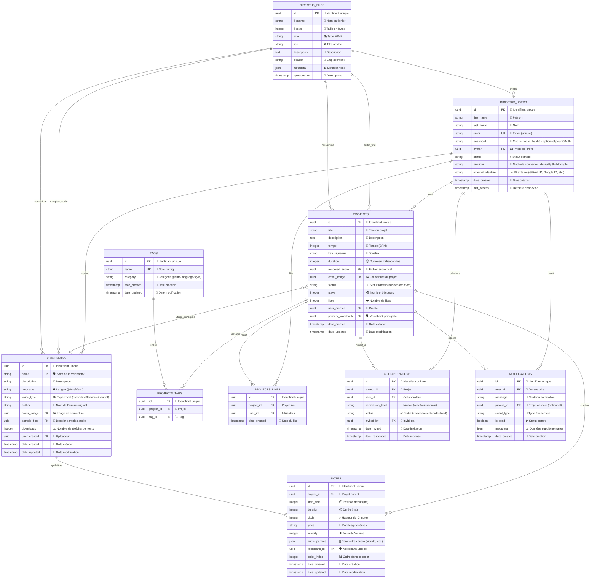

# 🎵 Architecture du projet UTAU Editor - Remplaçant de la section 2

> **Note :** Ce fichier remplace la section 2 du tutoriel principal pour les étudiants qui choisissent le projet UTAU Editor. Toutes les autres sections du tutoriel `tutoriel-directus-meme-manager.md` restent identiques.

---

## 2. Architecture du projet UTAU Editor

### Qu'est-ce qu'UTAU ?

**UTAU** est un logiciel japonais de synthèse vocale qui permet de créer des chansons à partir de samples vocaux enregistrés. Notre projet va créer un éditeur web moderne inspiré d'UTAU avec des fonctionnalités collaboratives.

### Structure de données du UTAU Editor

Notre application va gérer :

```
👤 Utilisateurs (Users) - SYSTÈME DIRECTUS INTÉGRÉ
├── 🎵 Projets créés
├── ❤️ Projets likés/favoris
├── 👤 Profil (nom, email, avatar)
└── 🔐 Authentification

🎵 Projects (Projets musicaux)
├── 🎼 Partition/Notes
├── 🗣️ Voicebank utilisée
├── 🎚️ Paramètres audio (tempo, tonalité)
├── 📁 Fichier audio généré
├── 👤 Créateur (utilisateur connecté)
├── 🏷️ Tags (genre musical, langue, etc.)
├── 📊 Statistiques (écoutes, likes)
└── ❤️ Liste des utilisateurs qui ont liké

🗣️ Voicebanks (Banques vocales)
├── 📁 Fichiers audio (.wav samples)
├── 📝 Métadonnées (nom, langue, genre vocal)
├── 👤 Créateur/Auteur
├── 🎵 Projets utilisant cette voicebank
└── 📊 Statistiques d'utilisation

🎼 Notes (Notes musicales dans un projet)
├── 🎵 Projet parent
├── 🎶 Hauteur (pitch)
├── ⏱️ Durée et position temporelle
├── 📝 Paroles/phonèmes
├── 🔊 Paramètres audio (volume, vibrato)
└── 🗣️ Voicebank utilisée

🏷️ Tags
└── 📛 Nom (genre, langue, style)

🔔 Notifications (Système temps réel)
├── 👤 Utilisateur destinataire
├── 📝 Message de notification
├── 🎵 Projet associé (optionnel)
├── 🔄 Type d'événement (nouveau_projet, nouveau_like, collaboration)
├── ✅ Statut (lu/non_lu)
└── 📅 Date de création

👥 Collaborations (Système collaboratif)
├── 🎵 Projet
├── 👤 Utilisateur collaborateur
├── 🔑 Permissions (lecture, écriture, admin)
├── ✅ Statut (invité, accepté, refusé)
└── 📅 Date d'invitation
```

### Modèle Conceptuel de Données (MCD) UTAU



### Relations et Cardinalités UTAU

**1️⃣ DIRECTUS_USERS → PROJECTS (1:N)**
- Un utilisateur peut créer plusieurs projets musicaux
- Un projet a un seul créateur principal
- Champ automatique : `user_created` dans `projects`

**2️⃣ PROJECTS → VOICEBANKS (N:1)**
- Un projet utilise une voicebank principale
- Une voicebank peut être utilisée par plusieurs projets
- Champ : `primary_voicebank` dans `projects`

**3️⃣ PROJECTS → NOTES (1:N)**
- Un projet contient plusieurs notes musicales
- Une note appartient à un seul projet
- Champ : `project_id` dans `notes`

**4️⃣ NOTES → VOICEBANKS (N:1)**
- Chaque note peut utiliser une voicebank spécifique
- Une voicebank peut synthétiser plusieurs notes
- Permet l'utilisation de plusieurs voicebanks dans un projet

**5️⃣ PROJECTS → TAGS (N:M)**
- Un projet peut avoir plusieurs tags (genre, langue, style)
- Un tag peut être utilisé par plusieurs projets
- Table de liaison : `projects_tags`

**6️⃣ USERS → PROJECTS (N:M) - Système de likes**
- Un utilisateur peut liker plusieurs projets
- Un projet peut être liké par plusieurs utilisateurs
- Table de liaison : `projects_likes`

**7️⃣ USERS → PROJECTS (N:M) - Système collaboratif**
- Un utilisateur peut collaborer sur plusieurs projets
- Un projet peut avoir plusieurs collaborateurs
- Table de liaison : `collaborations` avec permissions

**8️⃣ PROJECTS → DIRECTUS_FILES (N:1)**
- Un projet peut avoir un fichier audio final rendu
- Un projet peut avoir une image de couverture
- Relations multiples vers `directus_files`

**9️⃣ VOICEBANKS → DIRECTUS_FILES (N:1)**
- Une voicebank a des fichiers samples audio
- Une voicebank peut avoir une image de couverture
- Relations vers `directus_files`

**🔟 USERS → NOTIFICATIONS (1:N)**
- Un utilisateur peut recevoir plusieurs notifications
- Une notification appartient à un seul utilisateur
- Notifications pour collaborations, likes, nouveaux projets

### Système d'utilisateurs Directus intégré (identique)

**🔑 Collection `directus_users` - Pré-existante avec support OAuth**

Système identique au projet Meme Manager avec authentification classique et OAuth.

### Types de données Directus UTAU

```yaml
Voicebanks:
  id: UUID (Primary Key, Auto-generated)
  name: String (Required, Unique, max 100 chars)
  description: Text (Optional)
  language: String (Required, select: ja/en/fr/zh/ko/es)
  voice_type: String (Required, select: masculine/feminine/neutral)
  author: String (Required, max 100 chars)
  cover_image: File (Optional, Images only)
  sample_files: File (Required, ZIP/folder of WAV files)
  downloads: Integer (Default 0, Read-only)
  
Projects:
  id: UUID (Primary Key, Auto-generated)
  title: String (Required, max 255 chars)
  description: Text (Optional)
  tempo: Integer (Default 120, Range 40-300 BPM)
  key_signature: String (Default "C", Musical keys)
  duration: Integer (Calculated from notes, milliseconds)
  rendered_audio: File (Optional, Audio files only)
  cover_image: File (Optional, Images only)
  status: String (draft/published/archived)
  plays: Integer (Default 0, Read-only)
  likes: Integer (Default 0)
  user_created: M2O Relation → directus_users (Automatique)
  primary_voicebank: M2O Relation → Voicebanks
  tags: M2M Relation → Tags

Notes:
  id: UUID (Primary Key, Auto-generated)
  project_id: M2O Relation → Projects (Required)
  start_time: Integer (Required, milliseconds from start)
  duration: Integer (Required, milliseconds)
  pitch: Integer (Required, MIDI note 0-127)
  lyrics: String (Required, max 500 chars, phonemes)
  velocity: Integer (Default 100, Range 0-127)
  audio_params: JSON (Optional, vibrato/tremolo settings)
  voicebank_id: M2O Relation → Voicebanks (Required)
  order_index: Integer (Auto-increment within project)

Collaborations:
  id: UUID (Primary Key, Auto-generated)
  project_id: M2O Relation → Projects (Required)
  user_id: M2O Relation → directus_users (Required)
  permission_level: String (read/write/admin)
  status: String (invited/accepted/declined)
  invited_by: M2O Relation → directus_users (Required)
  date_invited: Timestamp (Automatique)
  date_responded: Timestamp (Optional)

Tags:
  id: UUID (Primary Key, Auto-generated)
  name: String (Required, Unique, max 50 chars)
  category: String (genre/language/style/mood)

Projects_Likes:
  id: UUID (Primary Key, Auto-generated)
  project_id: M2O Relation → Projects
  user_id: M2O Relation → directus_users
  date_created: Timestamp (Automatique)

Notifications:
  id: UUID (Primary Key, Auto-generated)
  user_id: M2O Relation → directus_users (Required)
  message: String (Required, max 255 chars)
  project_id: M2O Relation → Projects (Optional)
  event_type: String (nouveau_projet/nouveau_like/collaboration_invite/collaboration_accepted)
  is_read: Boolean (Default false)
  metadata: JSON (Optional, données contextuelles)
```

### Contraintes et Validations UTAU

**🛡️ Règles métier spécifiques :**
- Les projets en mode "draft" ne sont visibles que par le créateur et collaborateurs
- Une note ne peut pas dépasser la durée du projet
- Les fichiers de voicebanks doivent être au format WAV uniquement
- Taille maximale des samples : 500MB par voicebank
- Un projet peut avoir de 1 à 50 collaborateurs maximum
- Les notes doivent avoir des paroles/phonèmes correspondant à la langue de la voicebank
- Tempo valide : 40-300 BPM
- Pitch MIDI valide : 0-127 (C-1 à G9)

**🎵 Règles audio :**
- Formats audio supportés : WAV, MP3, OGG pour les rendus finaux
- Échantillonnage minimum : 44.1kHz, 16-bit pour les voicebanks
- Durée maximale d'un projet : 10 minutes (600,000 ms)
- Nombre maximum de notes par projet : 10,000

**👥 Règles collaboratives :**
- Un utilisateur ne peut pas s'inviter lui-même
- Le créateur du projet a automatiquement les permissions "admin"
- Les permissions "admin" peuvent inviter d'autres collaborateurs
- Les permissions "write" peuvent modifier notes et paramètres
- Les permissions "read" peuvent seulement consulter et liker

### Cas d'usage spécifiques UTAU

**🎼 Création musicale :**
1. Utilisateur crée un projet avec voicebank
2. Ajout de notes avec paroles et paramètres audio
3. Rendu audio du projet complet
4. Publication et partage avec tags

**👥 Collaboration :**
1. Créateur invite des collaborateurs
2. Collaborateurs acceptent/refusent
3. Travail simultané sur différentes parties
4. Notifications temps réel des modifications

**🗣️ Gestion des voicebanks :**
1. Upload de samples audio par les utilisateurs
2. Métadonnées complètes (langue, type vocal)
3. Utilisation dans les projets
4. Statistiques d'usage et téléchargements

---

## Note importante

Cette architecture remplace uniquement la **section 2** du tutoriel principal. Toutes les autres sections (configuration, création des collections, relations, API, etc.) du fichier `tutoriel-directus-meme-manager.md` s'appliquent en adaptant simplement :

- `memes` → `projects`
- `tags` → `tags` (identique)  
- `memes_likes` → `projects_likes`
- `notifications` → `notifications` (avec event_type adaptés)

**Collections supplémentaires spécifiques à UTAU :**
- `voicebanks` (nouvelle)
- `notes` (nouvelle)
- `collaborations` (nouvelle)

**Suivez le tutoriel principal en vous référant à ce modèle de données pour créer vos collections ! 🎵**
